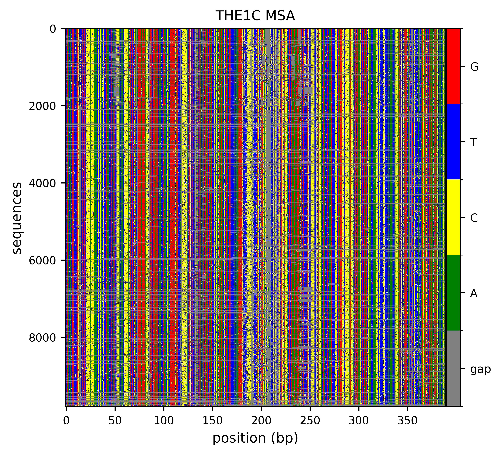
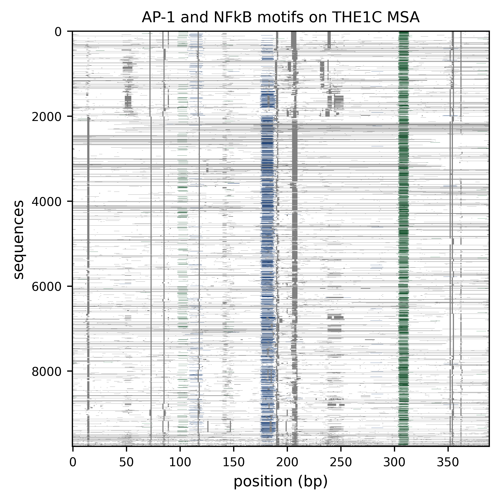
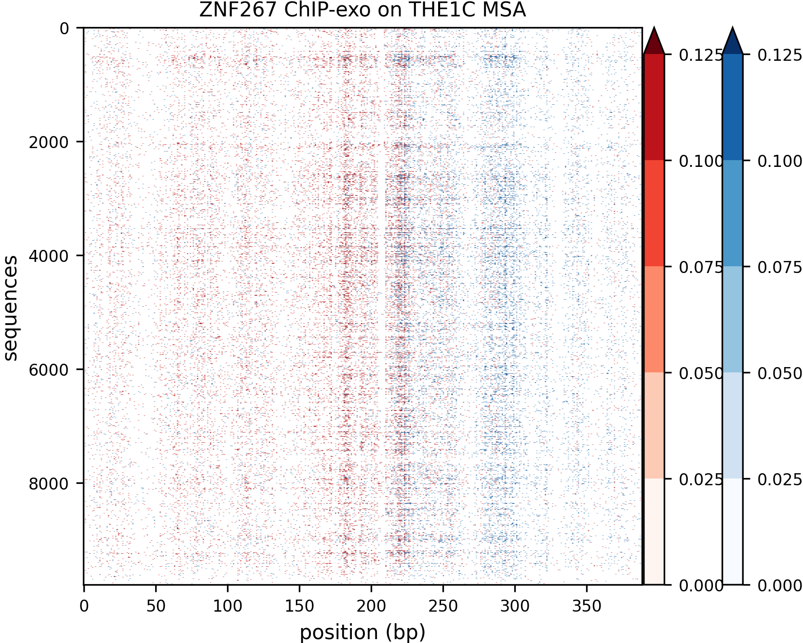
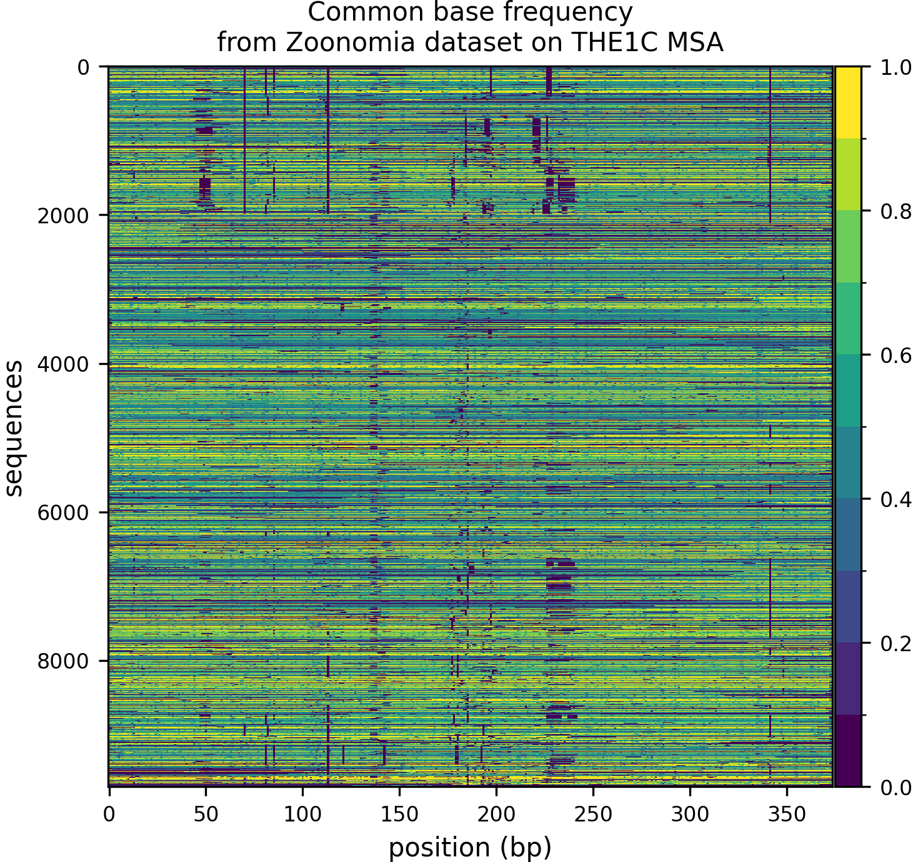
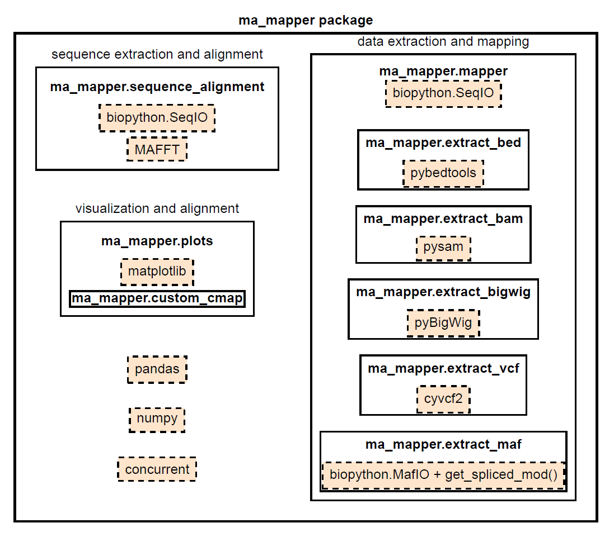
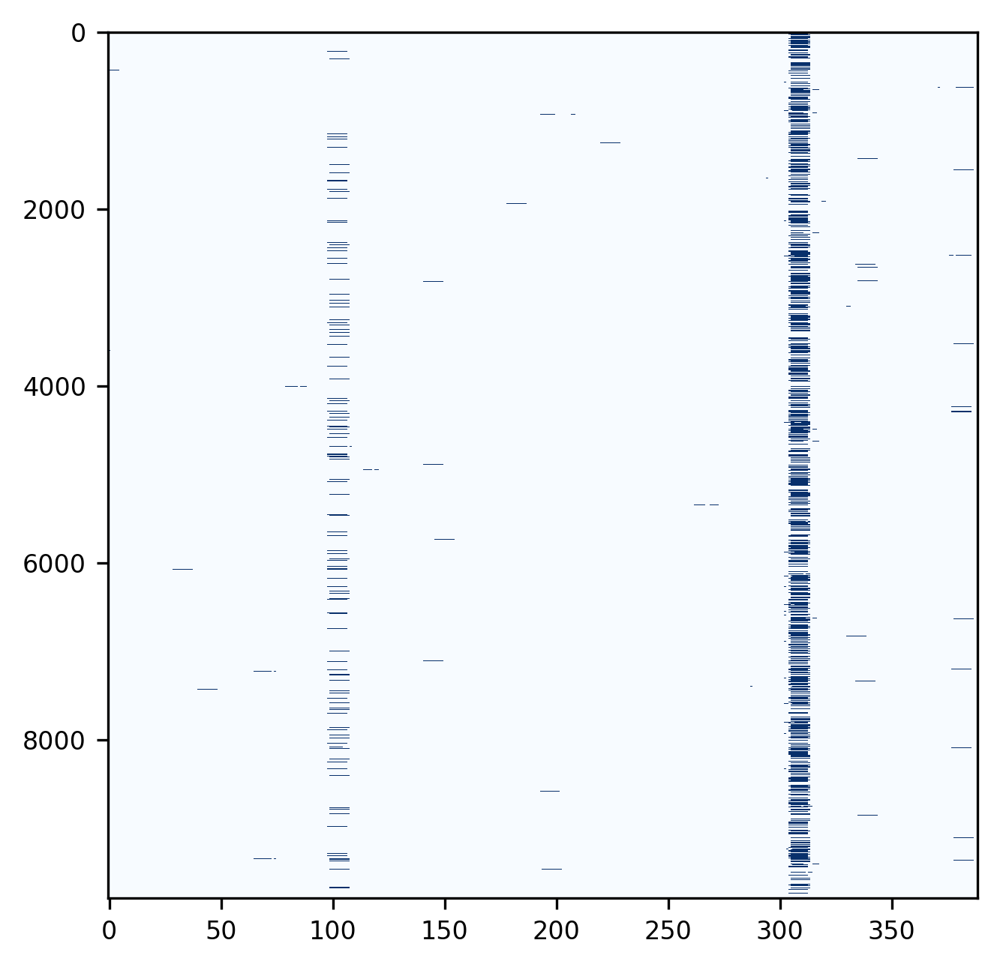

# `ma_mapper`
Multiple Alignment Mapper


A python package for mapping genome-wide data onto multiple alignment of transposable elements.

This multiple alignment of THE1C for example:




can be overlayed by genome-wide data such as TF motif prediction, conservation socre, ChIP-exo mapped reads, common base frequencies, alternater allele frequencies, and more:

<p>
  
  
  
  
  
</p>


## Quick links
- [Dependencies](#dependencies)
- [Installation](#installation)
- [Package structure](#package-structure)
- [Usage](#usage)
- [Documentaiton quick links](#documentation-quick-links)

## Dependencies
- `python` 3.10
- `biopython` 1.83
- `compress-pickle` 2.1.0
- `cyvcf2` 0.30.28
- `h5py` 3.7.0
- `logomaker` 0.8
- `matplotlib` 3.8.4
- `numpy` 1.21.5
- `pandas` 1.3.5
- `pybedtools` 0.10.0
- `pybigwig` 0.3.23
- `pysam` 0.22.0
- `scipy` 1.7.3

## Installation
To install this package, use the following command to install on a python environment:
```bash
pip install git+https://github.com/pkncsk/ma_mapper@experimental
```
## Package structure
`ma_mapper` is ultimately a wrapper of various external packages, guiding them to work under under the multiple alignment mapping framework. The package itself is separated into modules and submodules based on their main functions on the framework. Notably, the data extraction and data mapping/overlay are streamlined into one module as shown below:



## Usage examples

This section illustrates the `ma_mapper` workflow with minimal working example files in the `/test` folder.

### Required inputs
- A `FASTA` file of multiple alignment 
- A `BED` file with genomic coordinates for the multiple alignment (optional: if missing, coordinates are parsed from alignment headers).
- A genome-wide data file of interest (support multiple file types: `BED`, `BIGWIG`, `BAM`, `VCF`, `MAF`) - in this example, the AP-1(BZIP) motif from [HOMER transcription factor motif prediction](http://homer.ucsd.edu/homer/data/motifs/homer.KnownMotifs.hg38.191020.bed.gz) is used.

Import `ma_mapper` and path to the input.

```python
from ma_mapper import mapper
alignment_filepath = '/ma_mapper/test/THE1C.fasta.aligned'
genomewide_data_filepath  = '/ma_mapper/test/AP-1.bed'
```

Parse the alignment (and extract alignment coordinates).

```python
filtered_alignment_matrix, alignment_coordinate  = mapper.parse_and_filter(alignment_file=alignment_filepath,col_threshold = 0.10, col_content_threshold = 0.10, row_threshold = 0.10)
```

Extract genome-wide data using the coordinate table.

```python
data_matrix=mapper.map_and_overlay(alignment_filepath, genomewide_data_filepath,data_format='bed', col_threshold = 0.10, col_content_threshold = 0.10, row_threshold = 0.10)
```

Visualize the result.

```python
from ma_mapper import plots
plots.plot(
    data = [data_matrix], 
    alignment=filtered_alignment_matrix,
    show_alignment=False, 
    heatmap_color=['Blues'],
    heatmap_mode='overlay',
    )
```
<p>
  
</p>
This produces a heatmap overlay of the genome-wide data on the MSA. For advanced customization, see the full documentation.

## Documentation quick links
- [Getting started](docs/gettingstarted.md)
- [Package documentations](docs/package_docs.md)
## Under construction
- [Tutorials]()
- [API references]()

## License
This package is licensed under the MIT License. 

