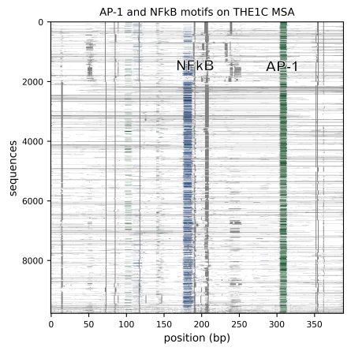

# MA MAPPER
Multiple Alignment MAPPER

A python package for mapping genome-wide data onto multiple alignment of transposable elements.

Basically, this alignment:


can be overlayed by genome-wide data such as TF motif prediction:



## Quick links
- [Dependencies](#dependencies)
- [Installation](#installation)
- [Documentaiton](#documentation)

## Dependencies
- python ^3.10
- biopython ^1.83
- compress-pickle ^2.1.0
- cyvcf2 ^0.30.28
- h5py ^3.7.0
- logomaker ^0.8
- matplotlib ^3.8.4
- numpy ^1.21.5
- pandas ^1.3.5
- pybedtools ^0.10.0
- pybigwig ^0.3.23
- pysam ^0.22.0
- scipy ^1.7.3

## Installation
insatall this package to a python environment with pip:
```bash
pip install git+https://github.com/pkncsk/ma_mapper
```
## Documentation
- [Getting started](docs/gettingstarted.md)
- [Tutorials](script/documentation/tutorial_nb/00overview.md)
- [API references](script/documentation/api_references/01overview.md)

## License
This package is licensed under the MIT License. 

