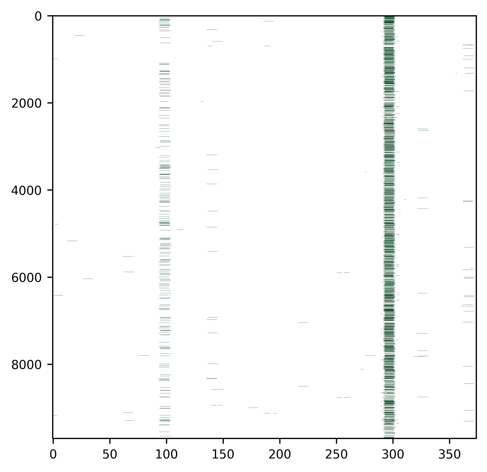
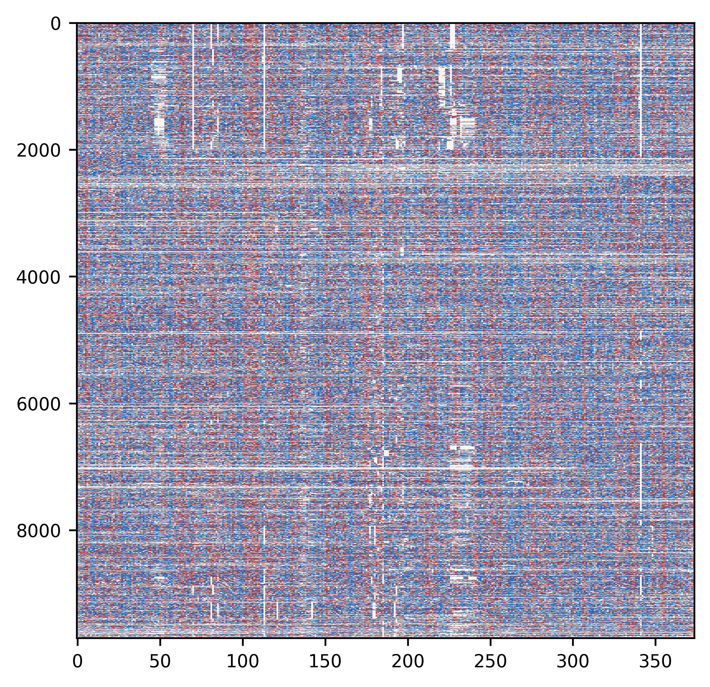
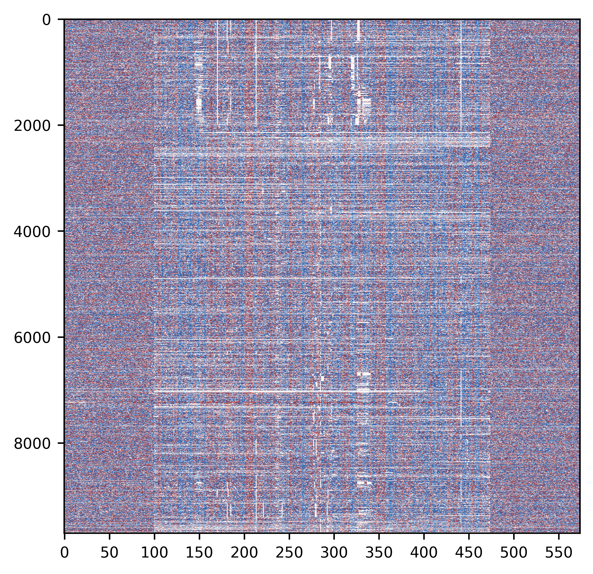

load libraries


```python
from ma_mapper import mapper
from ma_mapper import plots
from ma_mapper import custom_cmap
```

### Initial Parameters


```python
alignment_filepath = '/rds/project/rds-XrHDlpCeVDg/users/pakkanan/data/output/ma_mapper/hg38_main/alignment/THE1C.fasta.aligned'
genomewide_data_filepath = '/rds/project/rds-XrHDlpCeVDg/users/pakkanan/data/resource/annotation/homer_known_motif_hg38/AP-1(bZIP).bed'
```

## SIMPLE WORKFLOW

Extract genomewide data into data matrix using coordinates and alignment structure from the alignment file 


```python
output_matrix=mapper.map_and_overlay(alignment_filepath, genomewide_data_filepath,data_format='bed')
```

    2025-03-19 06:18:51,627 INFO: parse alignment
    2025-03-19 06:18:58,107 INFO: extract from bed file: /rds/project/rds-XrHDlpCeVDg/users/pakkanan/data/resource/annotation/homer_known_motif_hg38/AP-1(bZIP).bed
    2025-03-19 06:19:25,822 INFO: done, returning bed_out as object
    2025-03-19 06:19:26,057 INFO: {<class 'numpy.float64'>}
    2025-03-19 06:19:26,058 INFO: nested_data:False


```python
output_matrix
```


    array([[0., 0., 0., ..., 0., 0., 0.],
           [0., 0., 0., ..., 0., 0., 0.],
           [0., 0., 0., ..., 0., 0., 0.],
           ...,
           [0., 0., 0., ..., 0., 0., 0.],
           [0., 0., 0., ..., 0., 0., 0.],
           [0., 0., 0., ..., 0., 0., 0.]])


Output matrix can be used for downstream analyses or visualization. this package also includes visualization helper function (matplotlib helper)


```python
plots.plot(data = [output_matrix], heatmap_color=['Greens'], vlim = [[0,0.1]], opacity = 0.9)
```


    

    


## map_and_overlay() PIPELINE IN DETAIL


```python
from ma_mapper import extract_bed
```

Extract TE coordinates from alignment fasta the header for the alignment should be in >NAME::chromosome:start-stop(strand) format


```python
alignment_matrix, alignment_coordinate, filters  = mapper.parse_and_filter(alignment_file=alignment_filepath, preprocess_out=True)
```

    2025-03-19 06:20:49,671 INFO: parse alignment


```python
alignment_matrix
```


    array([[0., 0., 0., ..., 0., 0., 0.],
           [0., 0., 0., ..., 0., 0., 0.],
           [0., 0., 0., ..., 0., 0., 0.],
           ...,
           [0., 0., 0., ..., 0., 0., 0.],
           [0., 0., 0., ..., 0., 0., 0.],
           [0., 0., 0., ..., 0., 0., 0.]])


```python
alignment_coordinate
```


<div>
<style scoped>
    .dataframe tbody tr th:only-of-type {
        vertical-align: middle;
    }

    .dataframe tbody tr th {
        vertical-align: top;
    }

    .dataframe thead th {
        text-align: right;
    }
</style>
<table border="1" class="dataframe">
  <thead>
    <tr style="text-align: right;">
      <th></th>
      <th>chrom</th>
      <th>start</th>
      <th>end</th>
      <th>name</th>
      <th>score</th>
      <th>strand</th>
      <th>original_order</th>
    </tr>
  </thead>
  <tbody>
    <tr>
      <th>0</th>
      <td>chr1</td>
      <td>119563</td>
      <td>119944</td>
      <td>THE1C_0</td>
      <td>20</td>
      <td>-</td>
      <td>0</td>
    </tr>
    <tr>
      <th>1</th>
      <td>chr1</td>
      <td>296133</td>
      <td>296514</td>
      <td>THE1C_1</td>
      <td>20</td>
      <td>-</td>
      <td>1</td>
    </tr>
    <tr>
      <th>2</th>
      <td>chr1</td>
      <td>710552</td>
      <td>710933</td>
      <td>THE1C_2</td>
      <td>20</td>
      <td>-</td>
      <td>2</td>
    </tr>
    <tr>
      <th>3</th>
      <td>chr19</td>
      <td>181416</td>
      <td>181797</td>
      <td>THE1C_3502</td>
      <td>20</td>
      <td>-</td>
      <td>3</td>
    </tr>
    <tr>
      <th>4</th>
      <td>chr9</td>
      <td>138295330</td>
      <td>138295711</td>
      <td>THE1C_9041</td>
      <td>20</td>
      <td>+</td>
      <td>4</td>
    </tr>
    <tr>
      <th>...</th>
      <td>...</td>
      <td>...</td>
      <td>...</td>
      <td>...</td>
      <td>...</td>
      <td>...</td>
      <td>...</td>
    </tr>
    <tr>
      <th>9784</th>
      <td>chr2</td>
      <td>224734778</td>
      <td>224734901</td>
      <td>THE1C_4351</td>
      <td>20</td>
      <td>-</td>
      <td>9784</td>
    </tr>
    <tr>
      <th>9785</th>
      <td>chrX</td>
      <td>139157368</td>
      <td>139157702</td>
      <td>THE1C_9584</td>
      <td>20</td>
      <td>+</td>
      <td>9785</td>
    </tr>
    <tr>
      <th>9786</th>
      <td>chrX</td>
      <td>1159464</td>
      <td>1159569</td>
      <td>THE1C_9045</td>
      <td>20</td>
      <td>-</td>
      <td>9786</td>
    </tr>
    <tr>
      <th>9787</th>
      <td>chrY</td>
      <td>1159464</td>
      <td>1159569</td>
      <td>THE1C_9697</td>
      <td>20</td>
      <td>-</td>
      <td>9787</td>
    </tr>
    <tr>
      <th>9788</th>
      <td>chr2</td>
      <td>156425872</td>
      <td>156425923</td>
      <td>THE1C_4107</td>
      <td>20</td>
      <td>-</td>
      <td>9788</td>
    </tr>
  </tbody>
</table>
<p>9789 rows × 7 columns</p>
</div>


```python
filters
```


    [array([ True,  True,  True, ..., False, False, False]),
     array([False, False, False, ..., False, False, False])]


Then use alignment coordinate to extract genomewide data


```python
output_matrix=extract_bed.bed_io(coordinate_table=alignment_coordinate, bed=genomewide_data_filepath)
```

    2025-03-19 06:24:50,487 INFO: extract from bed file: /rds/project/rds-XrHDlpCeVDg/users/pakkanan/data/resource/annotation/homer_known_motif_hg38/AP-1(bZIP).bed
    2025-03-19 06:25:19,495 INFO: done, returning bed_out as object


Filter coordinate table (exclude rows with content lower than a set threshold)


```python
row_filter, col_filter = filters
alignment_coordinate_filtered=alignment_coordinate.iloc[row_filter]
```

overlay/map extracted data matrix onto alignment matrix and filter rows and columns 


```python
output_matrix_filtered = mapper.map_data(extracted_data=output_matrix, alignment_matrix= alignment_matrix, filter=filters)
```

    2025-03-19 06:26:23,378 INFO: {<class 'numpy.float64'>}
    2025-03-19 06:26:23,379 INFO: nested_data:False


Visualize the extracted data


```python
plots.plot(data = [output_matrix_filtered], heatmap_color=['Greens'], vlim = [[0,0.1]], opacity = 0.9)
```


    

    


It is possible to extend data extraction beyond the input coordinates by using extension_length argument. However the extended parts will be extracted as is, no alignment

Normal plot


```python
phyloP_data_filepath = '/rds/project/rds-XrHDlpCeVDg/users/pakkanan/data/resource/UCSC_phyloP_track/hg38.phyloP447way.bw'
phyloP_matrix=mapper.map_and_overlay(alignment_filepath, phyloP_data_filepath,data_format='bigwig')
plots.plot(data=[phyloP_matrix], heatmap_color=[custom_cmap.vlag_r_mpl], vlim =[[-0.5,0.5]])
```

    2025-03-19 06:30:31,482 INFO: parse alignment
    2025-03-19 06:30:39,864 INFO: done, returning bigwig_out as object
    2025-03-19 06:30:40,114 INFO: {<class 'numpy.float32'>}
    2025-03-19 06:30:40,115 INFO: nested_data:False


    

    


Extended plot


```python
phyloP_matrix_extended=mapper.map_and_overlay(alignment_filepath, phyloP_data_filepath,data_format='bigwig', extension_length=100)
plots.plot(data=[phyloP_matrix_extended], heatmap_color=[custom_cmap.vlag_r_mpl], vlim =[[-0.5,0.5]])
```

    2025-03-19 06:31:24,083 INFO: parse alignment
    2025-03-19 06:31:32,486 INFO: done, returning bigwig_out as object
    2025-03-19 06:31:32,731 INFO: {<class 'numpy.float32'>}
    2025-03-19 06:31:32,732 INFO: nested_data:False
    2025-03-19 06:31:36,108 INFO: done, returning bigwig_out as object
    2025-03-19 06:31:39,099 INFO: done, returning bigwig_out as object


    (9789, 8) 9699 9699


    

    

