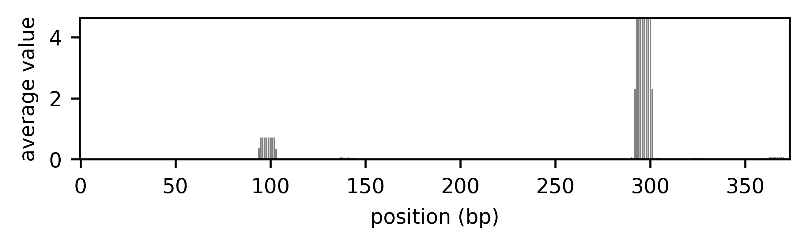
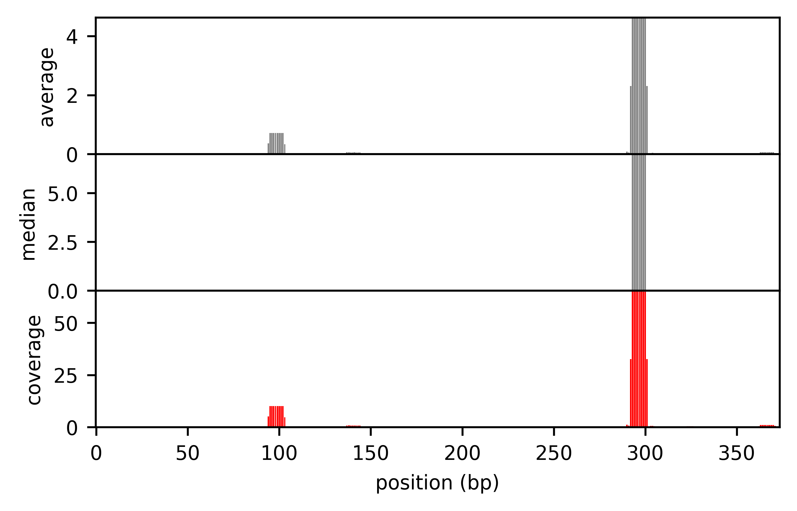

load libraries


```python
from ma_mapper import mapper
from ma_mapper import plots
```

### Initial Parameters


```python
alignment_filepath = '/rds/project/rds-XrHDlpCeVDg/users/pakkanan/data/output/ma_mapper/hg38_main/alignment/THE1C.fasta.aligned'
genomewide_data_filepath = '/rds/project/rds-XrHDlpCeVDg/users/pakkanan/data/resource/annotation/homer_known_motif_hg38/AP-1(bZIP).bed'
```

Extract genomewide data into data matrix using coordinates and alignment structure from the alignment file 


```python
output_matrix=mapper.map_and_overlay(alignment_filepath, genomewide_data_filepath,data_format='bed')
```

    2025-03-19 06:39:13,578 INFO: parse alignment
    2025-03-19 06:39:20,293 INFO: extract from bed file: /rds/project/rds-XrHDlpCeVDg/users/pakkanan/data/resource/annotation/homer_known_motif_hg38/AP-1(bZIP).bed
    2025-03-19 06:39:52,420 INFO: done, returning bed_out as object
    2025-03-19 06:39:52,678 INFO: {<class 'numpy.float64'>}
    2025-03-19 06:39:52,679 INFO: nested_data:False


```python
output_matrix
```


    array([[0., 0., 0., ..., 0., 0., 0.],
           [0., 0., 0., ..., 0., 0., 0.],
           [0., 0., 0., ..., 0., 0., 0.],
           ...,
           [0., 0., 0., ..., 0., 0., 0.],
           [0., 0., 0., ..., 0., 0., 0.],
           [0., 0., 0., ..., 0., 0., 0.]])


# DOWNSTREAM ANALYSES
As stated in the introduction, ma_mapper output is a numerical matrix of genome-wide data that has the same gap-structure like sequence alignment.

To properly analyze the extracted data, ma_mapper offer a function that would consider the gaps structure in each column using alignment matrix as reference


```python
alignment_matrix, coordinate_table=mapper.parse_and_filter(alignment_filepath)
mean_output=mapper.normalise(alignment_matrix=alignment_matrix, data_matrix=output_matrix, method = 'average')
coverage_output=mapper.normalise(alignment_matrix=alignment_matrix, data_matrix=output_matrix, method = 'perc_coverage')
median_output=mapper.normalise(alignment_matrix=alignment_matrix, data_matrix=output_matrix, method = 'median')
```

    2025-03-19 06:40:50,430 INFO: parse alignment


```python
alignment_matrix
```


    array([[3., 4., 1., ..., 1., 2., 1.],
           [3., 4., 1., ..., 1., 2., 1.],
           [3., 4., 1., ..., 1., 2., 1.],
           ...,
           [3., 4., 1., ..., 0., 0., 0.],
           [0., 0., 1., ..., 1., 2., 1.],
           [3., 4., 2., ..., 1., 0., 0.]])


```python
coordinate_table
```


<div>
<style scoped>
    .dataframe tbody tr th:only-of-type {
        vertical-align: middle;
    }

    .dataframe tbody tr th {
        vertical-align: top;
    }

    .dataframe thead th {
        text-align: right;
    }
</style>
<table border="1" class="dataframe">
  <thead>
    <tr style="text-align: right;">
      <th></th>
      <th>chrom</th>
      <th>start</th>
      <th>end</th>
      <th>name</th>
      <th>score</th>
      <th>strand</th>
      <th>original_order</th>
    </tr>
  </thead>
  <tbody>
    <tr>
      <th>0</th>
      <td>chr1</td>
      <td>119563</td>
      <td>119944</td>
      <td>THE1C_0</td>
      <td>20</td>
      <td>-</td>
      <td>0</td>
    </tr>
    <tr>
      <th>1</th>
      <td>chr1</td>
      <td>296133</td>
      <td>296514</td>
      <td>THE1C_1</td>
      <td>20</td>
      <td>-</td>
      <td>1</td>
    </tr>
    <tr>
      <th>2</th>
      <td>chr1</td>
      <td>710552</td>
      <td>710933</td>
      <td>THE1C_2</td>
      <td>20</td>
      <td>-</td>
      <td>2</td>
    </tr>
    <tr>
      <th>3</th>
      <td>chr19</td>
      <td>181416</td>
      <td>181797</td>
      <td>THE1C_3502</td>
      <td>20</td>
      <td>-</td>
      <td>3</td>
    </tr>
    <tr>
      <th>4</th>
      <td>chr9</td>
      <td>138295330</td>
      <td>138295711</td>
      <td>THE1C_9041</td>
      <td>20</td>
      <td>+</td>
      <td>4</td>
    </tr>
    <tr>
      <th>...</th>
      <td>...</td>
      <td>...</td>
      <td>...</td>
      <td>...</td>
      <td>...</td>
      <td>...</td>
      <td>...</td>
    </tr>
    <tr>
      <th>9775</th>
      <td>chr16</td>
      <td>63291039</td>
      <td>63291257</td>
      <td>THE1C_2951</td>
      <td>20</td>
      <td>+</td>
      <td>9775</td>
    </tr>
    <tr>
      <th>9776</th>
      <td>chrY</td>
      <td>16695786</td>
      <td>16696114</td>
      <td>THE1C_9770</td>
      <td>20</td>
      <td>+</td>
      <td>9776</td>
    </tr>
    <tr>
      <th>9778</th>
      <td>chr2</td>
      <td>190537612</td>
      <td>190537920</td>
      <td>THE1C_4233</td>
      <td>20</td>
      <td>+</td>
      <td>9778</td>
    </tr>
    <tr>
      <th>9782</th>
      <td>chr1</td>
      <td>104208527</td>
      <td>104208749</td>
      <td>THE1C_335</td>
      <td>20</td>
      <td>-</td>
      <td>9782</td>
    </tr>
    <tr>
      <th>9785</th>
      <td>chrX</td>
      <td>139157368</td>
      <td>139157702</td>
      <td>THE1C_9584</td>
      <td>20</td>
      <td>+</td>
      <td>9785</td>
    </tr>
  </tbody>
</table>
<p>9699 rows × 7 columns</p>
</div>


```python
mean_output
```


    array([1.13104524e-02, 9.03501067e-03, 8.78129821e-03, 8.69258781e-03,
           6.41175099e-03, 5.44927536e-03, 5.44170430e-03, 5.41786744e-03,
           5.41786744e-03, 4.59770115e-03, 5.65362871e-03, 5.64906617e-03,
           5.71029018e-03, 6.96055684e-03, 3.98826979e-03, 3.92700393e-03,
           5.74118728e-03, 4.72023947e-03, 4.73004153e-03, 4.72132658e-03,
           6.29722922e-03, 6.30300252e-03, 3.43367289e-03, 3.43642612e-03,
           2.52960791e-03, 1.60366552e-03, 2.39343515e-03, 4.43383356e-03,
           5.00113662e-03, 4.20406772e-03, 4.20693576e-03, 4.21364309e-03,
           4.20645748e-03, 4.21220401e-03, 4.21508316e-03, 3.42504852e-03,
           1.37127185e-03, 8.05338242e-04, 2.30282096e-03, 2.31026915e-03,
           2.32342007e-03, 1.51197953e-03, 2.31910946e-03, 2.31427910e-03,
           3.98826979e-03, 4.07136870e-03, 4.10628019e-03, 1.79349219e-03,
           2.71915059e-03, 9.26784059e-04, 1.85455027e-03, 9.17431193e-04,
           9.13122880e-04, 8.56478649e-04, 8.36620055e-04, 8.25179771e-04,
           0.00000000e+00, 0.00000000e+00, 0.00000000e+00, 0.00000000e+00,
           0.00000000e+00, 0.00000000e+00, 7.21349622e-03, 1.42440163e-02,
           1.42207717e-02, 1.41252750e-02, 1.41089395e-02, 1.40861332e-02,
           1.42091777e-02, 1.42207717e-02, 1.50639075e-02, 8.03540235e-03,
           0.00000000e+00, 0.00000000e+00, 0.00000000e+00, 1.04712042e-03,
           3.84660217e-03, 3.03844805e-03, 3.04164717e-03, 3.08056872e-03,
           3.05558820e-03, 3.49979809e-03, 3.27703554e-03, 3.03702838e-03,
           1.98019802e-03, 0.00000000e+00, 0.00000000e+00, 0.00000000e+00,
           0.00000000e+00, 0.00000000e+00, 0.00000000e+00, 6.91722389e-04,
           6.91403549e-04, 3.33640129e-03, 3.64894476e-01, 7.09918400e-01,
           7.12456747e-01, 7.12538932e-01, 7.11308153e-01, 7.11799954e-01,
           7.11349729e-01, 7.11560694e-01, 7.11152373e-01, 3.38237025e-01,
           1.32066728e-02, 2.91239515e-03, 1.97720400e-03, 1.98876930e-03,
           1.87727326e-03, 1.87837521e-03, 2.68722982e-03, 2.74659661e-03,
           2.36434567e-03, 2.41860465e-03, 2.35543517e-03, 2.33154581e-03,
           2.45527885e-03, 1.75994368e-03, 1.76325379e-03, 1.77535803e-03,
           8.24790857e-04, 0.00000000e+00, 8.15660685e-04, 8.12913715e-04,
           8.14616548e-04, 0.00000000e+00, 8.12159183e-04, 8.12913715e-04,
           0.00000000e+00, 0.00000000e+00, 8.18617706e-04, 1.62771771e-03,
           1.63589624e-03, 8.20152314e-04, 8.29482166e-04, 0.00000000e+00,
           2.87449393e-02, 6.10141542e-02, 6.28396266e-02, 5.64738292e-02,
           5.84042021e-02, 5.94331377e-02, 5.74088441e-02, 5.83690987e-02,
           5.58584757e-02, 2.81114849e-02, 5.60028001e-03, 3.85064177e-03,
           3.83453405e-03, 3.83319782e-03, 0.00000000e+00, 0.00000000e+00,
           0.00000000e+00, 0.00000000e+00, 0.00000000e+00, 0.00000000e+00,
           0.00000000e+00, 0.00000000e+00, 0.00000000e+00, 0.00000000e+00,
           0.00000000e+00, 0.00000000e+00, 0.00000000e+00, 0.00000000e+00,
           0.00000000e+00, 0.00000000e+00, 0.00000000e+00, 0.00000000e+00,
           0.00000000e+00, 0.00000000e+00, 0.00000000e+00, 0.00000000e+00,
           0.00000000e+00, 1.40433002e-03, 1.39941691e-03, 1.42467054e-03,
           1.47130947e-03, 1.59616919e-03, 1.54479918e-03, 1.49495453e-03,
           1.61052208e-03, 7.51032670e-04, 1.60771704e-03, 1.61110423e-03,
           9.54719040e-04, 2.00369914e-03, 7.00736982e-03, 1.08325219e-02,
           1.09417261e-02, 1.02330169e-02, 1.07151457e-02, 9.99397953e-03,
           7.94057377e-03, 7.45257453e-03, 7.18766336e-03, 2.81365904e-03,
           1.86145459e-03, 1.96933465e-03, 0.00000000e+00, 0.00000000e+00,
           0.00000000e+00, 0.00000000e+00, 0.00000000e+00, 0.00000000e+00,
           0.00000000e+00, 0.00000000e+00, 0.00000000e+00, 0.00000000e+00,
           9.31207077e-04, 9.32618326e-04, 9.31749359e-04, 9.31857892e-04,
           9.33380002e-04, 9.34033859e-04, 9.34579439e-04, 9.48541617e-04,
           9.34797850e-04, 1.63800164e-03, 2.46305419e-03, 2.66632809e-03,
           2.65319015e-03, 2.68989369e-03, 2.65856438e-03, 2.52890173e-03,
           3.33209922e-03, 3.35153923e-03, 1.04493208e-03, 8.67428076e-04,
           0.00000000e+00, 8.15549817e-04, 7.77000777e-04, 7.78513040e-04,
           1.63510015e-03, 1.60064026e-03, 7.98190768e-04, 0.00000000e+00,
           7.91034937e-04, 7.89681495e-04, 7.79625780e-04, 7.49437922e-04,
           0.00000000e+00, 0.00000000e+00, 0.00000000e+00, 0.00000000e+00,
           0.00000000e+00, 0.00000000e+00, 0.00000000e+00, 0.00000000e+00,
           0.00000000e+00, 0.00000000e+00, 3.13771063e-03, 7.55199256e-03,
           7.55111524e-03, 7.53012048e-03, 6.04580863e-03, 2.44129272e-03,
           1.52725564e-03, 4.34527305e-03, 5.19971638e-03, 5.20463686e-03,
           5.16735173e-03, 4.48377581e-03, 0.00000000e+00, 0.00000000e+00,
           0.00000000e+00, 1.17508813e-03, 1.97950629e-03, 1.97904540e-03,
           1.97858473e-03, 1.16495806e-03, 1.16198001e-03, 1.16198001e-03,
           3.47826087e-03, 2.67535187e-03, 7.05633306e-04, 1.51374010e-03,
           3.27064595e-03, 1.63570511e-03, 1.62733930e-03, 1.62790698e-03,
           1.62999185e-03, 1.97170030e-03, 1.75090463e-03, 9.28828515e-04,
           1.74114916e-03, 8.15850816e-04, 3.28908728e-03, 3.25467860e-03,
           2.44015803e-03, 2.44015803e-03, 8.51459812e-02, 5.07668529e-02,
           2.30309549e+00, 4.60989333e+00, 4.62653851e+00, 4.62202520e+00,
           4.60778617e+00, 4.61045904e+00, 4.60969091e+00, 4.59417249e+00,
           4.58932525e+00, 2.30688325e+00, 2.21651890e-02, 3.67143023e-02,
           4.16329363e-02, 3.11454608e-02, 3.48310693e-03, 3.70928480e-03,
           1.85013876e-03, 9.28289626e-04, 2.79524808e-03, 1.04299455e-03,
           0.00000000e+00, 0.00000000e+00, 0.00000000e+00, 8.11782442e-04,
           8.10278967e-04, 0.00000000e+00, 3.25770797e-03, 5.68577396e-03,
           4.88656195e-03, 4.86336267e-03, 1.66821131e-02, 3.10580600e-02,
           3.10544612e-02, 3.10868809e-02, 3.11591675e-02, 2.86742512e-02,
           2.61877173e-02, 2.68798517e-02, 2.62424524e-02, 1.43934997e-02,
           0.00000000e+00, 0.00000000e+00, 0.00000000e+00, 0.00000000e+00,
           0.00000000e+00, 0.00000000e+00, 1.04993000e-03, 0.00000000e+00,
           0.00000000e+00, 0.00000000e+00, 0.00000000e+00, 0.00000000e+00,
           0.00000000e+00, 0.00000000e+00, 0.00000000e+00, 0.00000000e+00,
           0.00000000e+00, 0.00000000e+00, 0.00000000e+00, 0.00000000e+00,
           0.00000000e+00, 0.00000000e+00, 0.00000000e+00, 0.00000000e+00,
           1.63992035e-03, 0.00000000e+00, 0.00000000e+00, 0.00000000e+00,
           0.00000000e+00, 1.64628410e-03, 3.35103245e-02, 6.02010645e-02,
           6.41010506e-02, 6.49427323e-02, 6.51195832e-02, 6.53051532e-02,
           6.54995832e-02, 6.56149157e-02, 6.64809881e-02, 3.58018637e-02,
           7.83085356e-04, 1.77887247e-03])


```python
coverage_output
```


    array([1.69006760e-01, 1.38034885e-01, 1.30532811e-01, 1.29214143e-01,
           9.32618326e-02, 6.95652174e-02, 6.94685655e-02, 6.91642651e-02,
           6.91642651e-02, 5.74712644e-02, 6.92281066e-02, 6.91722389e-02,
           6.99219205e-02, 8.54805227e-02, 4.69208211e-02, 4.62000462e-02,
           6.88942473e-02, 5.75638959e-02, 5.76834333e-02, 5.75771534e-02,
           8.01465537e-02, 8.02200321e-02, 4.57823051e-02, 4.58190149e-02,
           3.44946533e-02, 2.29095074e-02, 3.41919307e-02, 6.82128240e-02,
           7.95635372e-02, 6.81740711e-02, 6.82205799e-02, 6.83293475e-02,
           6.82128240e-02, 6.83060109e-02, 6.83526999e-02, 5.70841420e-02,
           2.28545309e-02, 1.15048320e-02, 3.45423143e-02, 3.46540372e-02,
           3.48513011e-02, 2.32612235e-02, 3.47866419e-02, 3.47141865e-02,
           5.86510264e-02, 5.98730691e-02, 6.03864734e-02, 2.56213169e-02,
           3.88450084e-02, 1.32397723e-02, 2.64935753e-02, 1.31061599e-02,
           1.30446126e-02, 1.22354093e-02, 1.19517151e-02, 1.17882824e-02,
           0.00000000e+00, 0.00000000e+00, 0.00000000e+00, 0.00000000e+00,
           0.00000000e+00, 0.00000000e+00, 8.14426992e-02, 1.75131349e-01,
           1.74845553e-01, 1.73671414e-01, 1.73470568e-01, 1.73190163e-01,
           1.74703005e-01, 1.74845553e-01, 1.82592818e-01, 1.04809596e-01,
           0.00000000e+00, 0.00000000e+00, 0.00000000e+00, 1.16346713e-02,
           4.66254808e-02, 3.50590160e-02, 3.50959289e-02, 3.55450237e-02,
           3.52567869e-02, 4.03822856e-02, 3.78119486e-02, 3.50426352e-02,
           2.32964473e-02, 0.00000000e+00, 0.00000000e+00, 0.00000000e+00,
           0.00000000e+00, 0.00000000e+00, 0.00000000e+00, 1.15287065e-02,
           1.15233925e-02, 4.60193281e-02, 5.17818014e+00, 1.00333295e+01,
           1.00692042e+01, 1.00703657e+01, 1.00529710e+01, 1.00599216e+01,
           1.00565755e+01, 1.00578035e+01, 1.00499014e+01, 4.76638814e+00,
           1.73772011e-01, 3.49487418e-02, 2.32612235e-02, 2.33972859e-02,
           2.34659158e-02, 2.34796901e-02, 3.50508237e-02, 3.58251732e-02,
           3.54651850e-02, 3.72093023e-02, 3.53315275e-02, 3.49731872e-02,
           3.50754121e-02, 2.34659158e-02, 2.35100505e-02, 2.36714404e-02,
           1.17827265e-02, 0.00000000e+00, 1.16522955e-02, 1.16130531e-02,
           1.16373793e-02, 0.00000000e+00, 1.16022740e-02, 1.16130531e-02,
           0.00000000e+00, 0.00000000e+00, 1.16945387e-02, 2.32531101e-02,
           2.33699462e-02, 1.17164616e-02, 1.18497452e-02, 0.00000000e+00,
           3.77867746e-01, 8.10773670e-01, 8.36003901e-01, 7.51314801e-01,
           7.75387694e-01, 7.86615058e-01, 7.62865270e-01, 7.72532189e-01,
           7.39125167e-01, 3.72417107e-01, 7.00035002e-02, 4.66744457e-02,
           4.64792006e-02, 4.64630038e-02, 0.00000000e+00, 0.00000000e+00,
           0.00000000e+00, 0.00000000e+00, 0.00000000e+00, 0.00000000e+00,
           0.00000000e+00, 0.00000000e+00, 0.00000000e+00, 0.00000000e+00,
           0.00000000e+00, 0.00000000e+00, 0.00000000e+00, 0.00000000e+00,
           0.00000000e+00, 0.00000000e+00, 0.00000000e+00, 0.00000000e+00,
           0.00000000e+00, 0.00000000e+00, 0.00000000e+00, 0.00000000e+00,
           0.00000000e+00, 2.34055003e-02, 2.33236152e-02, 2.37445091e-02,
           2.45218244e-02, 2.66028199e-02, 2.57466529e-02, 2.49159088e-02,
           2.68420346e-02, 1.25172112e-02, 2.47341083e-02, 2.47862189e-02,
           1.36388434e-02, 3.08261406e-02, 9.66533768e-02, 1.46056475e-01,
           1.47528891e-01, 1.35618296e-01, 1.44473874e-01, 1.32450331e-01,
           1.02459016e-01, 9.48509485e-02, 9.14793518e-02, 3.83680778e-02,
           2.65922085e-02, 2.81333521e-02, 0.00000000e+00, 0.00000000e+00,
           0.00000000e+00, 0.00000000e+00, 0.00000000e+00, 0.00000000e+00,
           0.00000000e+00, 0.00000000e+00, 0.00000000e+00, 0.00000000e+00,
           1.16400885e-02, 1.16577291e-02, 1.16468670e-02, 1.16482236e-02,
           1.16672500e-02, 1.16754232e-02, 1.16822430e-02, 1.18567702e-02,
           1.16849731e-02, 2.34000234e-02, 3.51864884e-02, 3.80904012e-02,
           3.79027164e-02, 3.84270526e-02, 3.79794911e-02, 3.61271676e-02,
           4.93644329e-02, 4.96524330e-02, 1.49276011e-02, 1.44571346e-02,
           0.00000000e+00, 1.35924969e-02, 1.29500130e-02, 1.29752173e-02,
           2.72516692e-02, 2.66773376e-02, 1.33031795e-02, 0.00000000e+00,
           1.31839156e-02, 1.31613583e-02, 1.29937630e-02, 1.24906320e-02,
           0.00000000e+00, 0.00000000e+00, 0.00000000e+00, 0.00000000e+00,
           0.00000000e+00, 0.00000000e+00, 0.00000000e+00, 0.00000000e+00,
           0.00000000e+00, 0.00000000e+00, 4.64846020e-02, 1.16184501e-01,
           1.16171004e-01, 1.15848007e-01, 9.30124404e-02, 3.48756103e-02,
           2.34962406e-02, 7.04638873e-02, 8.27227606e-02, 8.28010409e-02,
           8.22078685e-02, 7.07964602e-02, 0.00000000e+00, 0.00000000e+00,
           0.00000000e+00, 1.17508813e-02, 2.32883093e-02, 2.32828871e-02,
           2.32774674e-02, 1.16495806e-02, 1.16198001e-02, 1.16198001e-02,
           4.63768116e-02, 3.48958939e-02, 1.17605551e-02, 2.32883093e-02,
           4.67235136e-02, 2.33672158e-02, 2.32477043e-02, 2.32558140e-02,
           2.32855979e-02, 2.31964741e-02, 2.33453951e-02, 1.16103564e-02,
           2.32153221e-02, 1.16550117e-02, 4.69869611e-02, 4.64954086e-02,
           3.48594004e-02, 3.48594004e-02, 1.19809236e+00, 7.13351563e-01,
           3.25325684e+01, 6.51271832e+01, 6.53616223e+01, 6.53173122e+01,
           6.51249274e+01, 6.51597908e+01, 6.51405996e+01, 6.48834499e+01,
           6.48059667e+01, 3.25698259e+01, 3.26644890e-01, 5.92540955e-01,
           6.70752862e-01, 4.96020302e-01, 4.64414258e-02, 4.63660600e-02,
           2.31267345e-02, 1.16036203e-02, 3.49406010e-02, 1.15888284e-02,
           0.00000000e+00, 0.00000000e+00, 0.00000000e+00, 1.15968920e-02,
           1.15754138e-02, 0.00000000e+00, 4.65386853e-02, 8.12253423e-02,
           6.98080279e-02, 6.94766095e-02, 2.31696015e-01, 4.28786650e-01,
           4.28736964e-01, 4.29184549e-01, 4.30182537e-01, 3.94706292e-01,
           3.59212051e-01, 3.70756575e-01, 3.59962843e-01, 1.97330238e-01,
           0.00000000e+00, 0.00000000e+00, 0.00000000e+00, 0.00000000e+00,
           0.00000000e+00, 0.00000000e+00, 1.16658889e-02, 0.00000000e+00,
           0.00000000e+00, 0.00000000e+00, 0.00000000e+00, 0.00000000e+00,
           0.00000000e+00, 0.00000000e+00, 0.00000000e+00, 0.00000000e+00,
           0.00000000e+00, 0.00000000e+00, 0.00000000e+00, 0.00000000e+00,
           0.00000000e+00, 0.00000000e+00, 0.00000000e+00, 0.00000000e+00,
           2.34274335e-02, 0.00000000e+00, 0.00000000e+00, 0.00000000e+00,
           0.00000000e+00, 2.35183443e-02, 5.30973451e-01, 9.69840331e-01,
           1.02703341e+00, 1.03908372e+00, 1.04191333e+00, 1.04488245e+00,
           1.04799333e+00, 1.05175093e+00, 1.06563333e+00, 5.76262874e-01,
           1.30514226e-02, 2.73672687e-02])


```python
median_output
```


    array([0., 0., 0., 0., 0., 0., 0., 0., 0., 0., 0., 0., 0., 0., 0., 0., 0.,
           0., 0., 0., 0., 0., 0., 0., 0., 0., 0., 0., 0., 0., 0., 0., 0., 0.,
           0., 0., 0., 0., 0., 0., 0., 0., 0., 0., 0., 0., 0., 0., 0., 0., 0.,
           0., 0., 0., 0., 0., 0., 0., 0., 0., 0., 0., 0., 0., 0., 0., 0., 0.,
           0., 0., 0., 0., 0., 0., 0., 0., 0., 0., 0., 0., 0., 0., 0., 0., 0.,
           0., 0., 0., 0., 0., 0., 0., 0., 0., 0., 0., 0., 0., 0., 0., 0., 0.,
           0., 0., 0., 0., 0., 0., 0., 0., 0., 0., 0., 0., 0., 0., 0., 0., 0.,
           0., 0., 0., 0., 0., 0., 0., 0., 0., 0., 0., 0., 0., 0., 0., 0., 0.,
           0., 0., 0., 0., 0., 0., 0., 0., 0., 0., 0., 0., 0., 0., 0., 0., 0.,
           0., 0., 0., 0., 0., 0., 0., 0., 0., 0., 0., 0., 0., 0., 0., 0., 0.,
           0., 0., 0., 0., 0., 0., 0., 0., 0., 0., 0., 0., 0., 0., 0., 0., 0.,
           0., 0., 0., 0., 0., 0., 0., 0., 0., 0., 0., 0., 0., 0., 0., 0., 0.,
           0., 0., 0., 0., 0., 0., 0., 0., 0., 0., 0., 0., 0., 0., 0., 0., 0.,
           0., 0., 0., 0., 0., 0., 0., 0., 0., 0., 0., 0., 0., 0., 0., 0., 0.,
           0., 0., 0., 0., 0., 0., 0., 0., 0., 0., 0., 0., 0., 0., 0., 0., 0.,
           0., 0., 0., 0., 0., 0., 0., 0., 0., 0., 0., 0., 0., 0., 0., 0., 0.,
           0., 0., 0., 0., 0., 0., 0., 0., 0., 0., 0., 0., 0., 0., 0., 0., 0.,
           0., 0., 0., 0., 7., 7., 7., 7., 7., 7., 7., 7., 0., 0., 0., 0., 0.,
           0., 0., 0., 0., 0., 0., 0., 0., 0., 0., 0., 0., 0., 0., 0., 0., 0.,
           0., 0., 0., 0., 0., 0., 0., 0., 0., 0., 0., 0., 0., 0., 0., 0., 0.,
           0., 0., 0., 0., 0., 0., 0., 0., 0., 0., 0., 0., 0., 0., 0., 0., 0.,
           0., 0., 0., 0., 0., 0., 0., 0., 0., 0., 0., 0., 0., 0., 0., 0., 0.])


### Visualization
the plot function can also helps plotting a 2D plot


```python
plots.plot(aggregated_data=[mean_output], aggregated=True,heatmap=False,agg_colset=['grey'], agg_ylabel=['average value'],agg_ylabel_fs=8, agg_xlabel='position (bp)', agg_xlabel_fs=8)
```


    

    


Plots can be stacked 


```python
plots.plot(aggregated_data=[mean_output, median_output, coverage_output], aggregated=True,heatmap=False,agg_colset=['grey','grey','red'], agg_ylabel=['average','median','coverage'],agg_ylabel_fs=8, agg_xlabel='position (bp)', agg_xlabel_fs=8)
```


    

    


Since the plot function accepts 1d array as long as the length matches, a user can make their own analysis and plot the result using plots module
