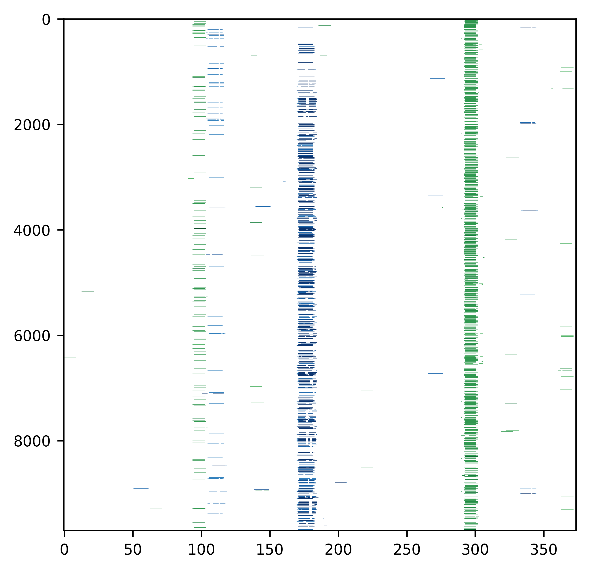
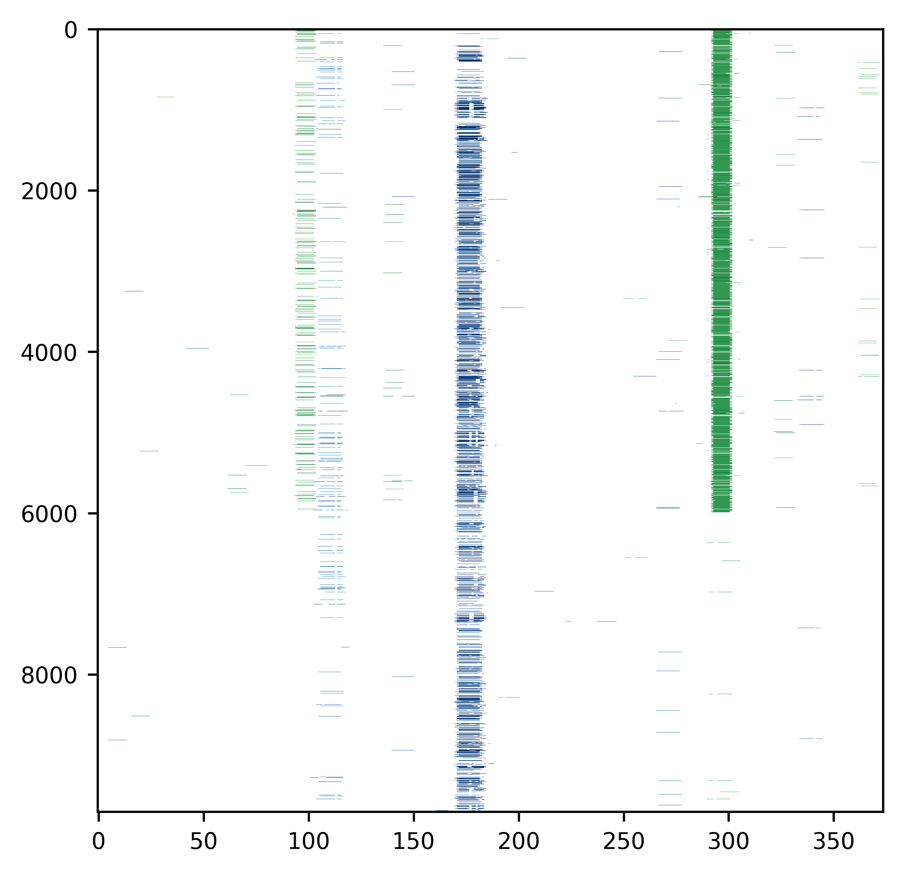
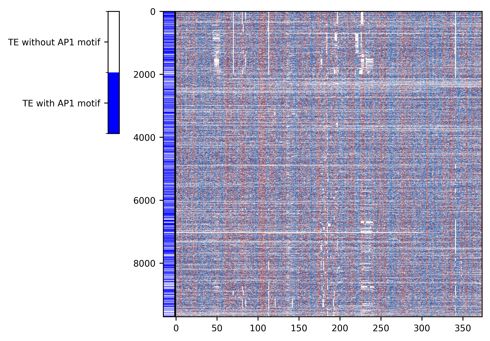
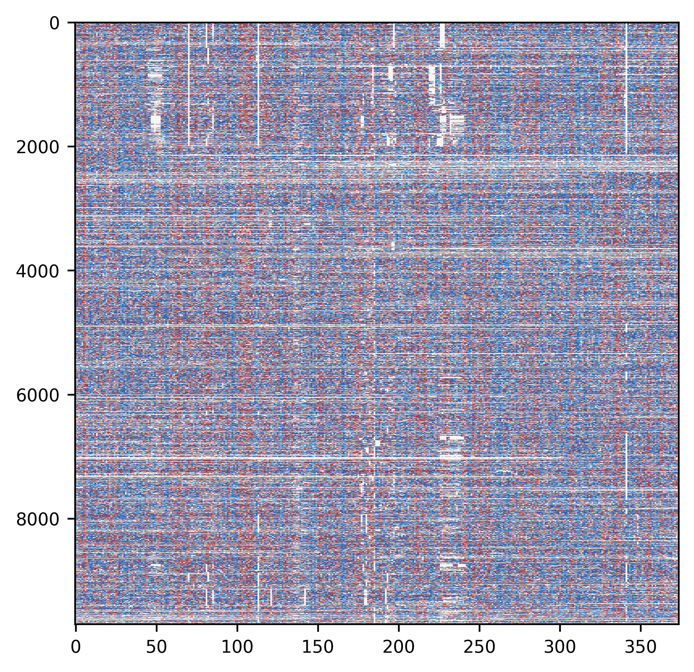
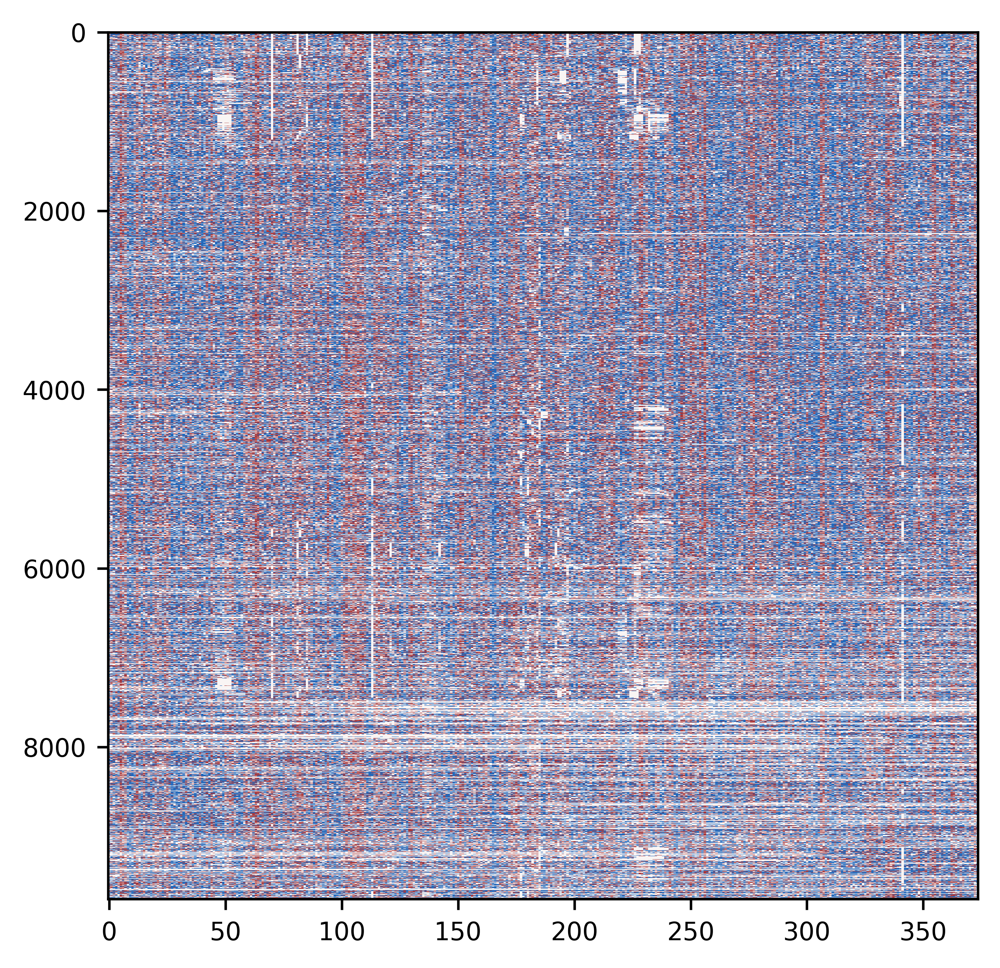
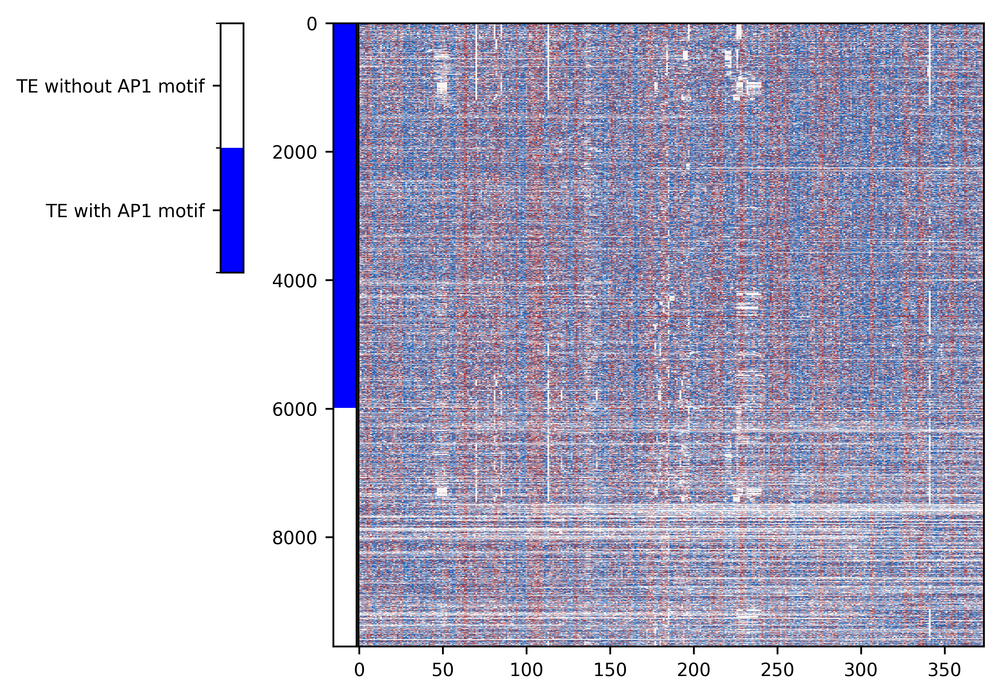

Load libraries


```python
from ma_mapper import mapper
from ma_mapper import plots
from ma_mapper import custom_cmap
```

### Initial Parameters


```python
alignment_filepath = '/rds/project/rds-XrHDlpCeVDg/users/pakkanan/data/output/ma_mapper/hg38_main/alignment/THE1C.fasta.aligned'
AP1_motif_data_filepath = '/rds/project/rds-XrHDlpCeVDg/users/pakkanan/data/resource/annotation/homer_known_motif_hg38/AP-1(bZIP).bed'
NFkB_motif_data_filepath = '/rds/project/rds-XrHDlpCeVDg/users/pakkanan/data/resource/annotation/homer_known_motif_hg38/NFkB-p65(RHD).bed'
phyloP_data_filepath = '/rds/project/rds-XrHDlpCeVDg/users/pakkanan/data/resource/UCSC_phyloP_track/hg38.phyloP447way.bw'
```

Extract genomewide data into data matrix using coordinates and alignment structure from the alignment file 


```python
ap1_matrix=mapper.map_and_overlay(alignment_filepath, AP1_motif_data_filepath,data_format='bed')
nfkb_matrix=mapper.map_and_overlay(alignment_filepath, NFkB_motif_data_filepath,data_format='bed')
```

    2025-03-19 06:48:34,974 INFO: parse alignment
    2025-03-19 06:48:41,666 INFO: extract from bed file: /rds/project/rds-XrHDlpCeVDg/users/pakkanan/data/resource/annotation/homer_known_motif_hg38/AP-1(bZIP).bed
    2025-03-19 06:49:14,391 INFO: done, returning bed_out as object
    2025-03-19 06:49:14,646 INFO: {<class 'numpy.float64'>}
    2025-03-19 06:49:14,646 INFO: nested_data:False
    2025-03-19 06:49:15,120 INFO: parse alignment
    2025-03-19 06:49:20,846 INFO: extract from bed file: /rds/project/rds-XrHDlpCeVDg/users/pakkanan/data/resource/annotation/homer_known_motif_hg38/NFkB-p65(RHD).bed
    2025-03-19 06:49:54,572 INFO: done, returning bed_out as object
    2025-03-19 06:49:54,828 INFO: {<class 'numpy.float64'>}
    2025-03-19 06:49:54,828 INFO: nested_data:False


```python
ap1_matrix
```


    array([[0., 0., 0., ..., 0., 0., 0.],
           [0., 0., 0., ..., 0., 0., 0.],
           [0., 0., 0., ..., 0., 0., 0.],
           ...,
           [0., 0., 0., ..., 0., 0., 0.],
           [0., 0., 0., ..., 0., 0., 0.],
           [0., 0., 0., ..., 0., 0., 0.]])


```python
nfkb_matrix
```


    array([[0., 0., 0., ..., 0., 0., 0.],
           [0., 0., 0., ..., 0., 0., 0.],
           [0., 0., 0., ..., 0., 0., 0.],
           ...,
           [0., 0., 0., ..., 0., 0., 0.],
           [0., 0., 0., ..., 0., 0., 0.],
           [0., 0., 0., ..., 0., 0., 0.]])


# DATA OVERLAY
Since different kinds of data are overlaid on the same TE alignment, it is possible to overlay their plot to gain visual insight about the data 


```python
plots.plot(data=[nfkb_matrix,ap1_matrix], heatmap_color=["Blues","Greens"], vlim =[[0,10],[0,10]], opacity=0.99)
```


    

    


# PLOT SORTING
Genomewide data can be used to sort data matrix

calculate AP-1 coverage


```python
alignment_matrix, coordinate_table=mapper.parse_and_filter(alignment_filepath)
ap1_coverage_array=mapper.normalise(alignment_matrix=alignment_matrix, data_matrix=ap1_matrix, method='perc_coverage')
```

    2025-03-19 06:53:05,526 INFO: parse alignment


```python
alignment_matrix
```


    array([[3., 4., 1., ..., 1., 2., 1.],
           [3., 4., 1., ..., 1., 2., 1.],
           [3., 4., 1., ..., 1., 2., 1.],
           ...,
           [3., 4., 1., ..., 0., 0., 0.],
           [0., 0., 1., ..., 1., 2., 1.],
           [3., 4., 2., ..., 1., 0., 0.]])


```python
coordinate_table
```


<div>
<style scoped>
    .dataframe tbody tr th:only-of-type {
        vertical-align: middle;
    }

    .dataframe tbody tr th {
        vertical-align: top;
    }

    .dataframe thead th {
        text-align: right;
    }
</style>
<table border="1" class="dataframe">
  <thead>
    <tr style="text-align: right;">
      <th></th>
      <th>chrom</th>
      <th>start</th>
      <th>end</th>
      <th>name</th>
      <th>score</th>
      <th>strand</th>
      <th>original_order</th>
    </tr>
  </thead>
  <tbody>
    <tr>
      <th>0</th>
      <td>chr1</td>
      <td>119563</td>
      <td>119944</td>
      <td>THE1C_0</td>
      <td>20</td>
      <td>-</td>
      <td>0</td>
    </tr>
    <tr>
      <th>1</th>
      <td>chr1</td>
      <td>296133</td>
      <td>296514</td>
      <td>THE1C_1</td>
      <td>20</td>
      <td>-</td>
      <td>1</td>
    </tr>
    <tr>
      <th>2</th>
      <td>chr1</td>
      <td>710552</td>
      <td>710933</td>
      <td>THE1C_2</td>
      <td>20</td>
      <td>-</td>
      <td>2</td>
    </tr>
    <tr>
      <th>3</th>
      <td>chr19</td>
      <td>181416</td>
      <td>181797</td>
      <td>THE1C_3502</td>
      <td>20</td>
      <td>-</td>
      <td>3</td>
    </tr>
    <tr>
      <th>4</th>
      <td>chr9</td>
      <td>138295330</td>
      <td>138295711</td>
      <td>THE1C_9041</td>
      <td>20</td>
      <td>+</td>
      <td>4</td>
    </tr>
    <tr>
      <th>...</th>
      <td>...</td>
      <td>...</td>
      <td>...</td>
      <td>...</td>
      <td>...</td>
      <td>...</td>
      <td>...</td>
    </tr>
    <tr>
      <th>9775</th>
      <td>chr16</td>
      <td>63291039</td>
      <td>63291257</td>
      <td>THE1C_2951</td>
      <td>20</td>
      <td>+</td>
      <td>9775</td>
    </tr>
    <tr>
      <th>9776</th>
      <td>chrY</td>
      <td>16695786</td>
      <td>16696114</td>
      <td>THE1C_9770</td>
      <td>20</td>
      <td>+</td>
      <td>9776</td>
    </tr>
    <tr>
      <th>9778</th>
      <td>chr2</td>
      <td>190537612</td>
      <td>190537920</td>
      <td>THE1C_4233</td>
      <td>20</td>
      <td>+</td>
      <td>9778</td>
    </tr>
    <tr>
      <th>9782</th>
      <td>chr1</td>
      <td>104208527</td>
      <td>104208749</td>
      <td>THE1C_335</td>
      <td>20</td>
      <td>-</td>
      <td>9782</td>
    </tr>
    <tr>
      <th>9785</th>
      <td>chrX</td>
      <td>139157368</td>
      <td>139157702</td>
      <td>THE1C_9584</td>
      <td>20</td>
      <td>+</td>
      <td>9785</td>
    </tr>
  </tbody>
</table>
<p>9699 rows × 7 columns</p>
</div>


```python
ap1_coverage_array
```


    array([1.69006760e-01, 1.38034885e-01, 1.30532811e-01, 1.29214143e-01,
           9.32618326e-02, 6.95652174e-02, 6.94685655e-02, 6.91642651e-02,
           6.91642651e-02, 5.74712644e-02, 6.92281066e-02, 6.91722389e-02,
           6.99219205e-02, 8.54805227e-02, 4.69208211e-02, 4.62000462e-02,
           6.88942473e-02, 5.75638959e-02, 5.76834333e-02, 5.75771534e-02,
           8.01465537e-02, 8.02200321e-02, 4.57823051e-02, 4.58190149e-02,
           3.44946533e-02, 2.29095074e-02, 3.41919307e-02, 6.82128240e-02,
           7.95635372e-02, 6.81740711e-02, 6.82205799e-02, 6.83293475e-02,
           6.82128240e-02, 6.83060109e-02, 6.83526999e-02, 5.70841420e-02,
           2.28545309e-02, 1.15048320e-02, 3.45423143e-02, 3.46540372e-02,
           3.48513011e-02, 2.32612235e-02, 3.47866419e-02, 3.47141865e-02,
           5.86510264e-02, 5.98730691e-02, 6.03864734e-02, 2.56213169e-02,
           3.88450084e-02, 1.32397723e-02, 2.64935753e-02, 1.31061599e-02,
           1.30446126e-02, 1.22354093e-02, 1.19517151e-02, 1.17882824e-02,
           0.00000000e+00, 0.00000000e+00, 0.00000000e+00, 0.00000000e+00,
           0.00000000e+00, 0.00000000e+00, 8.14426992e-02, 1.75131349e-01,
           1.74845553e-01, 1.73671414e-01, 1.73470568e-01, 1.73190163e-01,
           1.74703005e-01, 1.74845553e-01, 1.82592818e-01, 1.04809596e-01,
           0.00000000e+00, 0.00000000e+00, 0.00000000e+00, 1.16346713e-02,
           4.66254808e-02, 3.50590160e-02, 3.50959289e-02, 3.55450237e-02,
           3.52567869e-02, 4.03822856e-02, 3.78119486e-02, 3.50426352e-02,
           2.32964473e-02, 0.00000000e+00, 0.00000000e+00, 0.00000000e+00,
           0.00000000e+00, 0.00000000e+00, 0.00000000e+00, 1.15287065e-02,
           1.15233925e-02, 4.60193281e-02, 5.17818014e+00, 1.00333295e+01,
           1.00692042e+01, 1.00703657e+01, 1.00529710e+01, 1.00599216e+01,
           1.00565755e+01, 1.00578035e+01, 1.00499014e+01, 4.76638814e+00,
           1.73772011e-01, 3.49487418e-02, 2.32612235e-02, 2.33972859e-02,
           2.34659158e-02, 2.34796901e-02, 3.50508237e-02, 3.58251732e-02,
           3.54651850e-02, 3.72093023e-02, 3.53315275e-02, 3.49731872e-02,
           3.50754121e-02, 2.34659158e-02, 2.35100505e-02, 2.36714404e-02,
           1.17827265e-02, 0.00000000e+00, 1.16522955e-02, 1.16130531e-02,
           1.16373793e-02, 0.00000000e+00, 1.16022740e-02, 1.16130531e-02,
           0.00000000e+00, 0.00000000e+00, 1.16945387e-02, 2.32531101e-02,
           2.33699462e-02, 1.17164616e-02, 1.18497452e-02, 0.00000000e+00,
           3.77867746e-01, 8.10773670e-01, 8.36003901e-01, 7.51314801e-01,
           7.75387694e-01, 7.86615058e-01, 7.62865270e-01, 7.72532189e-01,
           7.39125167e-01, 3.72417107e-01, 7.00035002e-02, 4.66744457e-02,
           4.64792006e-02, 4.64630038e-02, 0.00000000e+00, 0.00000000e+00,
           0.00000000e+00, 0.00000000e+00, 0.00000000e+00, 0.00000000e+00,
           0.00000000e+00, 0.00000000e+00, 0.00000000e+00, 0.00000000e+00,
           0.00000000e+00, 0.00000000e+00, 0.00000000e+00, 0.00000000e+00,
           0.00000000e+00, 0.00000000e+00, 0.00000000e+00, 0.00000000e+00,
           0.00000000e+00, 0.00000000e+00, 0.00000000e+00, 0.00000000e+00,
           0.00000000e+00, 2.34055003e-02, 2.33236152e-02, 2.37445091e-02,
           2.45218244e-02, 2.66028199e-02, 2.57466529e-02, 2.49159088e-02,
           2.68420346e-02, 1.25172112e-02, 2.47341083e-02, 2.47862189e-02,
           1.36388434e-02, 3.08261406e-02, 9.66533768e-02, 1.46056475e-01,
           1.47528891e-01, 1.35618296e-01, 1.44473874e-01, 1.32450331e-01,
           1.02459016e-01, 9.48509485e-02, 9.14793518e-02, 3.83680778e-02,
           2.65922085e-02, 2.81333521e-02, 0.00000000e+00, 0.00000000e+00,
           0.00000000e+00, 0.00000000e+00, 0.00000000e+00, 0.00000000e+00,
           0.00000000e+00, 0.00000000e+00, 0.00000000e+00, 0.00000000e+00,
           1.16400885e-02, 1.16577291e-02, 1.16468670e-02, 1.16482236e-02,
           1.16672500e-02, 1.16754232e-02, 1.16822430e-02, 1.18567702e-02,
           1.16849731e-02, 2.34000234e-02, 3.51864884e-02, 3.80904012e-02,
           3.79027164e-02, 3.84270526e-02, 3.79794911e-02, 3.61271676e-02,
           4.93644329e-02, 4.96524330e-02, 1.49276011e-02, 1.44571346e-02,
           0.00000000e+00, 1.35924969e-02, 1.29500130e-02, 1.29752173e-02,
           2.72516692e-02, 2.66773376e-02, 1.33031795e-02, 0.00000000e+00,
           1.31839156e-02, 1.31613583e-02, 1.29937630e-02, 1.24906320e-02,
           0.00000000e+00, 0.00000000e+00, 0.00000000e+00, 0.00000000e+00,
           0.00000000e+00, 0.00000000e+00, 0.00000000e+00, 0.00000000e+00,
           0.00000000e+00, 0.00000000e+00, 4.64846020e-02, 1.16184501e-01,
           1.16171004e-01, 1.15848007e-01, 9.30124404e-02, 3.48756103e-02,
           2.34962406e-02, 7.04638873e-02, 8.27227606e-02, 8.28010409e-02,
           8.22078685e-02, 7.07964602e-02, 0.00000000e+00, 0.00000000e+00,
           0.00000000e+00, 1.17508813e-02, 2.32883093e-02, 2.32828871e-02,
           2.32774674e-02, 1.16495806e-02, 1.16198001e-02, 1.16198001e-02,
           4.63768116e-02, 3.48958939e-02, 1.17605551e-02, 2.32883093e-02,
           4.67235136e-02, 2.33672158e-02, 2.32477043e-02, 2.32558140e-02,
           2.32855979e-02, 2.31964741e-02, 2.33453951e-02, 1.16103564e-02,
           2.32153221e-02, 1.16550117e-02, 4.69869611e-02, 4.64954086e-02,
           3.48594004e-02, 3.48594004e-02, 1.19809236e+00, 7.13351563e-01,
           3.25325684e+01, 6.51271832e+01, 6.53616223e+01, 6.53173122e+01,
           6.51249274e+01, 6.51597908e+01, 6.51405996e+01, 6.48834499e+01,
           6.48059667e+01, 3.25698259e+01, 3.26644890e-01, 5.92540955e-01,
           6.70752862e-01, 4.96020302e-01, 4.64414258e-02, 4.63660600e-02,
           2.31267345e-02, 1.16036203e-02, 3.49406010e-02, 1.15888284e-02,
           0.00000000e+00, 0.00000000e+00, 0.00000000e+00, 1.15968920e-02,
           1.15754138e-02, 0.00000000e+00, 4.65386853e-02, 8.12253423e-02,
           6.98080279e-02, 6.94766095e-02, 2.31696015e-01, 4.28786650e-01,
           4.28736964e-01, 4.29184549e-01, 4.30182537e-01, 3.94706292e-01,
           3.59212051e-01, 3.70756575e-01, 3.59962843e-01, 1.97330238e-01,
           0.00000000e+00, 0.00000000e+00, 0.00000000e+00, 0.00000000e+00,
           0.00000000e+00, 0.00000000e+00, 1.16658889e-02, 0.00000000e+00,
           0.00000000e+00, 0.00000000e+00, 0.00000000e+00, 0.00000000e+00,
           0.00000000e+00, 0.00000000e+00, 0.00000000e+00, 0.00000000e+00,
           0.00000000e+00, 0.00000000e+00, 0.00000000e+00, 0.00000000e+00,
           0.00000000e+00, 0.00000000e+00, 0.00000000e+00, 0.00000000e+00,
           2.34274335e-02, 0.00000000e+00, 0.00000000e+00, 0.00000000e+00,
           0.00000000e+00, 2.35183443e-02, 5.30973451e-01, 9.69840331e-01,
           1.02703341e+00, 1.03908372e+00, 1.04191333e+00, 1.04488245e+00,
           1.04799333e+00, 1.05175093e+00, 1.06563333e+00, 5.76262874e-01,
           1.30514226e-02, 2.73672687e-02])


Since the coordinate table was filtered in parse and filter function, reset index to match positions in output matrices


```python
coordinate_table = coordinate_table.reset_index()
```


```python
coordinate_table
```


<div>
<style scoped>
    .dataframe tbody tr th:only-of-type {
        vertical-align: middle;
    }

    .dataframe tbody tr th {
        vertical-align: top;
    }

    .dataframe thead th {
        text-align: right;
    }
</style>
<table border="1" class="dataframe">
  <thead>
    <tr style="text-align: right;">
      <th></th>
      <th>index</th>
      <th>chrom</th>
      <th>start</th>
      <th>end</th>
      <th>name</th>
      <th>score</th>
      <th>strand</th>
      <th>original_order</th>
    </tr>
  </thead>
  <tbody>
    <tr>
      <th>0</th>
      <td>0</td>
      <td>chr1</td>
      <td>119563</td>
      <td>119944</td>
      <td>THE1C_0</td>
      <td>20</td>
      <td>-</td>
      <td>0</td>
    </tr>
    <tr>
      <th>1</th>
      <td>1</td>
      <td>chr1</td>
      <td>296133</td>
      <td>296514</td>
      <td>THE1C_1</td>
      <td>20</td>
      <td>-</td>
      <td>1</td>
    </tr>
    <tr>
      <th>2</th>
      <td>2</td>
      <td>chr1</td>
      <td>710552</td>
      <td>710933</td>
      <td>THE1C_2</td>
      <td>20</td>
      <td>-</td>
      <td>2</td>
    </tr>
    <tr>
      <th>3</th>
      <td>3</td>
      <td>chr19</td>
      <td>181416</td>
      <td>181797</td>
      <td>THE1C_3502</td>
      <td>20</td>
      <td>-</td>
      <td>3</td>
    </tr>
    <tr>
      <th>4</th>
      <td>4</td>
      <td>chr9</td>
      <td>138295330</td>
      <td>138295711</td>
      <td>THE1C_9041</td>
      <td>20</td>
      <td>+</td>
      <td>4</td>
    </tr>
    <tr>
      <th>...</th>
      <td>...</td>
      <td>...</td>
      <td>...</td>
      <td>...</td>
      <td>...</td>
      <td>...</td>
      <td>...</td>
      <td>...</td>
    </tr>
    <tr>
      <th>9694</th>
      <td>9775</td>
      <td>chr16</td>
      <td>63291039</td>
      <td>63291257</td>
      <td>THE1C_2951</td>
      <td>20</td>
      <td>+</td>
      <td>9775</td>
    </tr>
    <tr>
      <th>9695</th>
      <td>9776</td>
      <td>chrY</td>
      <td>16695786</td>
      <td>16696114</td>
      <td>THE1C_9770</td>
      <td>20</td>
      <td>+</td>
      <td>9776</td>
    </tr>
    <tr>
      <th>9696</th>
      <td>9778</td>
      <td>chr2</td>
      <td>190537612</td>
      <td>190537920</td>
      <td>THE1C_4233</td>
      <td>20</td>
      <td>+</td>
      <td>9778</td>
    </tr>
    <tr>
      <th>9697</th>
      <td>9782</td>
      <td>chr1</td>
      <td>104208527</td>
      <td>104208749</td>
      <td>THE1C_335</td>
      <td>20</td>
      <td>-</td>
      <td>9782</td>
    </tr>
    <tr>
      <th>9698</th>
      <td>9785</td>
      <td>chrX</td>
      <td>139157368</td>
      <td>139157702</td>
      <td>THE1C_9584</td>
      <td>20</td>
      <td>+</td>
      <td>9785</td>
    </tr>
  </tbody>
</table>
<p>9699 rows × 8 columns</p>
</div>


Find peaks of coverage


```python
import scipy
peaks, _ = scipy.signal.find_peaks(ap1_coverage_array, width = 6)
```


```python
peaks
```


    array([ 28,  70,  76,  97, 113, 138, 180, 188, 225, 294, 326, 370])


```python
import numpy as np
index_of_rows_with_ap1 = np.unique(np.where(ap1_matrix[:, peaks] != 0)[0])
index_of_rows_without_ap1=list(set(np.arange(ap1_matrix.shape[0])) - set(index_of_rows_with_ap1))
index_sorted=np.concatenate((index_of_rows_with_ap1, index_of_rows_without_ap1))
```


```python
index_of_rows_with_ap1
```


    array([  16,   18,   19, ..., 9680, 9684, 9685])


```python
index_of_rows_without_ap1
```


    [0,
     1,
     2,
     3,
     4,
     5,
     6,
     7,
     8,
     9,
     10,
     11,
     12,
     13,
     14,
     15,
     8201,
     17,
     8202,
     8212,
     8214,
     8219,
     30,
     8223,
     33,
     34,
     8225,
     8226,
     37,
     38,
     39,
     8227,
     8228,
     42,
     8231,
     8233,
     8234,
     47,
     50,
     51,
     8243,
     8244,
     8246,
     8247,
     57,
     8249,
     59,
     8251,
     8252,
     8254,
     8256,
     8259,
     68,
     8260,
     8261,
     71,
     73,
     74,
     75,
     8268,
     78,
     79,
     80,
     81,
     8270,
     83,
     84,
     8278,
     87,
     90,
     98,
     8292,
     8293,
     8294,
     8295,
     8296,
     110,
     8303,
     113,
     8306,
     115,
     8307,
     117,
     8309,
     120,
     125,
     127,
     8319,
     8320,
     8321,
     133,
     8325,
     135,
     8327,
     8330,
     139,
     8331,
     142,
     8334,
     8335,
     8337,
     146,
     8338,
     8339,
     8340,
     8342,
     8343,
     154,
     155,
     8349,
     158,
     8350,
     8352,
     8353,
     8355,
     8356,
     168,
     8360,
     8361,
     8362,
     8363,
     8364,
     8366,
     8368,
     8369,
     178,
     8370,
     181,
     182,
     8373,
     185,
     8377,
     8380,
     190,
     8382,
     8383,
     8384,
     194,
     8385,
     8386,
     198,
     8392,
     8393,
     203,
     204,
     8399,
     208,
     209,
     210,
     8403,
     214,
     215,
     8406,
     217,
     218,
     219,
     8411,
     8412,
     8414,
     223,
     224,
     8415,
     226,
     227,
     228,
     8419,
     230,
     231,
     8420,
     8421,
     8424,
     8425,
     236,
     237,
     238,
     239,
     240,
     241,
     8427,
     8429,
     244,
     8430,
     8431,
     8433,
     8437,
     8439,
     250,
     251,
     252,
     8445,
     8446,
     8447,
     256,
     8192,
     8449,
     8450,
     260,
     8451,
     262,
     263,
     264,
     265,
     266,
     267,
     268,
     8452,
     8453,
     8454,
     8456,
     273,
     8457,
     8461,
     276,
     8463,
     8465,
     8466,
     8468,
     8470,
     284,
     8476,
     8478,
     8482,
     8483,
     8486,
     295,
     296,
     8487,
     8488,
     8489,
     8491,
     8493,
     8494,
     303,
     8498,
     307,
     308,
     8501,
     310,
     311,
     313,
     314,
     315,
     316,
     317,
     8506,
     8508,
     320,
     323,
     324,
     8516,
     327,
     8519,
     8521,
     331,
     332,
     333,
     8526,
     8527,
     336,
     337,
     338,
     340,
     343,
     347,
     8539,
     8542,
     351,
     353,
     8545,
     8546,
     8548,
     8549,
     358,
     8550,
     360,
     361,
     8551,
     363,
     8552,
     8553,
     8554,
     8555,
     8557,
     8559,
     8560,
     8561,
     372,
     8564,
     8567,
     376,
     377,
     378,
     379,
     380,
     8569,
     382,
     8570,
     384,
     8572,
     386,
     387,
     8577,
     8581,
     8582,
     391,
     392,
     393,
     8584,
     395,
     8585,
     397,
     398,
     399,
     400,
     401,
     8589,
     403,
     404,
     405,
     8593,
     8594,
     408,
     8598,
     410,
     8599,
     8602,
     8604,
     414,
     8609,
     8610,
     419,
     8613,
     422,
     423,
     8614,
     8615,
     426,
     8616,
     8617,
     429,
     8618,
     431,
     8619,
     8622,
     434,
     435,
     436,
     8626,
     8628,
     439,
     440,
     441,
     8630,
     443,
     8631,
     445,
     446,
     447,
     448,
     449,
     8636,
     451,
     452,
     8639,
     8642,
     455,
     8643,
     8645,
     458,
     8647,
     460,
     461,
     8648,
     8649,
     464,
     465,
     8651,
     8652,
     8655,
     8656,
     8658,
     8659,
     8663,
     473,
     474,
     476,
     8668,
     479,
     8672,
     8673,
     483,
     8675,
     8678,
     488,
     489,
     490,
     491,
     8681,
     8682,
     8685,
     495,
     8689,
     498,
     499,
     500,
     8691,
     8693,
     503,
     8694,
     8695,
     8696,
     507,
     8697,
     8701,
     510,
     8704,
     8706,
     8708,
     8709,
     8710,
     520,
     521,
     522,
     523,
     524,
     8712,
     8713,
     8714,
     8717,
     8718,
     530,
     8719,
     8720,
     533,
     8723,
     535,
     8724,
     8725,
     8729,
     8730,
     8731,
     541,
     542,
     8734,
     544,
     545,
     549,
     550,
     551,
     8743,
     553,
     8744,
     8746,
     8748,
     8749,
     560,
     561,
     562,
     563,
     8752,
     565,
     8753,
     8756,
     8757,
     8761,
     8763,
     572,
     8764,
     8766,
     575,
     576,
     577,
     8768,
     8769,
     580,
     8770,
     582,
     583,
     8772,
     585,
     8773,
     8774,
     588,
     589,
     590,
     591,
     8775,
     593,
     8777,
     8778,
     8779,
     8782,
     8784,
     8785,
     8786,
     601,
     602,
     8788,
     604,
     8790,
     606,
     607,
     608,
     609,
     8794,
     611,
     8795,
     8798,
     8802,
     615,
     8804,
     617,
     8806,
     619,
     8807,
     8809,
     622,
     8810,
     8811,
     8812,
     8813,
     8817,
     8820,
     8821,
     630,
     8822,
     634,
     8826,
     8827,
     8828,
     8830,
     8831,
     640,
     8834,
     643,
     644,
     645,
     646,
     647,
     8835,
     8837,
     653,
     656,
     657,
     8850,
     8853,
     663,
     664,
     665,
     667,
     8859,
     669,
     8867,
     679,
     8873,
     682,
     683,
     684,
     686,
     688,
     690,
     8889,
     8890,
     699,
     700,
     701,
     702,
     703,
     8895,
     705,
     706,
     707,
     8897,
     8900,
     8901,
     711,
     8904,
     8906,
     715,
     717,
     718,
     719,
     8912,
     721,
     723,
     8917,
     8920,
     8922,
     733,
     735,
     8927,
     8928,
     738,
     741,
     8933,
     743,
     8935,
     745,
     746,
     8936,
     748,
     8938,
     8939,
     8940,
     752,
     8942,
     754,
     755,
     8943,
     8945,
     758,
     759,
     760,
     761,
     762,
     763,
     764,
     8951,
     8952,
     767,
     768,
     8953,
     770,
     8954,
     772,
     8957,
     8959,
     775,
     8961,
     777,
     8966,
     780,
     8972,
     782,
     783,
     8974,
     785,
     8977,
     8978,
     8981,
     8982,
     8985,
     794,
     8986,
     8989,
     798,
     8992,
     802,
     808,
     9003,
     9004,
     813,
     817,
     819,
     820,
     9011,
     822,
     9015,
     9016,
     9017,
     826,
     9018,
     9020,
     829,
     9021,
     831,
     832,
     9025,
     834,
     9026,
     9027,
     9028,
     838,
     9030,
     840,
     841,
     9033,
     9034,
     9035,
     9036,
     9037,
     9038,
     9041,
     852,
     9044,
     9046,
     9047,
     9049,
     858,
     862,
     863,
     864,
     865,
     9058,
     9059,
     868,
     9060,
     9063,
     9064,
     874,
     9066,
     9068,
     877,
     9069,
     9071,
     9072,
     9073,
     9074,
     9075,
     9077,
     886,
     887,
     9078,
     889,
     890,
     9079,
     9080,
     893,
     894,
     9081,
     896,
     9083,
     899,
     9091,
     901,
     9094,
     9096,
     907,
     913,
     9106,
     915,
     9108,
     9110,
     920,
     922,
     923,
     925,
     926,
     9118,
     928,
     929,
     9119,
     931,
     932,
     9122,
     934,
     9123,
     9124,
     937,
     938,
     939,
     9127,
     941,
     9130,
     9132,
     9133,
     9136,
     9137,
     947,
     9139,
     9140,
     9142,
     953,
     954,
     955,
     956,
     957,
     9146,
     9148,
     960,
     961,
     962,
     963,
     964,
     965,
     9156,
     9158,
     968,
     969,
     970,
     971,
     9161,
     974,
     976,
     9168,
     9170,
     9171,
     9174,
     9176,
     9179,
     9180,
     9181,
     9182,
     991,
     9184,
     994,
     9186,
     9188,
     9191,
     1002,
     1006,
     9198,
     1008,
     1009,
     1010,
     1011,
     1012,
     9199,
     9200,
     9201,
     9202,
     9203,
     1018,
     9207,
     1020,
     1021,
     1022,
     9210,
     9213,
     9214,
     9215,
     9216,
     1028,
     1029,
     9221,
     9223,
     1032,
     1033,
     1034,
     1035,
     9224,
     1037,
     1038,
     1039,
     9226,
     1041,
     9227,
     9228,
     1044,
     1045,
     9230,
     9231,
     9237,
     1049,
     1050,
     9239,
     1052,
     9240,
     9241,
     1055,
     9247,
     1057,
     1058,
     9248,
     9251,
     9253,
     1063,
     1064,
     9256,
     9259,
     1068,
     1069,
     9261,
     9269,
     1079,
     9271,
     9273,
     1082,
     9275,
     1084,
     9276,
     1086,
     9277,
     9278,
     9279,
     1093,
     1094,
     1095,
     1096,
     1097,
     1098,
     9288,
     1100,
     9291,
     9294,
     9295,
     9296,
     1105,
     1106,
     1107,
     9298,
     9299,
     9300,
     9301,
     1112,
     1113,
     9303,
     9307,
     9308,
     1119,
     9311,
     1123,
     1129,
     1130,
     1131,
     9322,
     1133,
     9325,
     9327,
     1136,
     9329,
     9331,
     9333,
     9334,
     9335,
     1144,
     1147,
     1148,
     1149,
     1150,
     1151,
     1152,
     1153,
     9339,
     1155,
     9340,
     9341,
     9343,
     9349,
     1160,
     1161,
     9350,
     1163,
     9354,
     9361,
     9362,
     1171,
     1172,
     1173,
     1174,
     9363,
     1176,
     9365,
     1178,
     9368,
     1180,
     9370,
     1182,
     9372,
     1184,
     9374,
     1187,
     9380,
     9381,
     9384,
     9387,
     1197,
     9390,
     9391,
     1200,
     9393,
     1203,
     9395,
     9398,
     1208,
     1209,
     1214,
     9407,
     1217,
     1218,
     9411,
     9412,
     9414,
     1223,
     9415,
     1225,
     1226,
     1227,
     1228,
     1229,
     1230,
     1231,
     9416,
     1233,
     1234,
     9418,
     9419,
     9420,
     9421,
     9422,
     9423,
     1241,
     9425,
     9426,
     1244,
     9429,
     9432,
     9434,
     9435,
     9436,
     ...]


```python
index_sorted
```


    array([  16,   18,   19, ..., 8188, 8189, 8191])


The sorted index can be used to rearrange matrix of mapped genomewide data


```python
ap1_matrix_sorted = ap1_matrix[index_sorted]
nfkb_matrix_sorted = nfkb_matrix[index_sorted]
```


```python
ap1_matrix_sorted
```


    array([[0., 0., 0., ..., 0., 0., 0.],
           [0., 0., 0., ..., 0., 0., 0.],
           [0., 0., 0., ..., 0., 0., 0.],
           ...,
           [0., 0., 0., ..., 0., 0., 0.],
           [0., 0., 0., ..., 0., 0., 0.],
           [0., 0., 0., ..., 0., 0., 0.]])


```python
nfkb_matrix_sorted
```


    array([[0., 0., 0., ..., 0., 0., 0.],
           [0., 0., 0., ..., 0., 0., 0.],
           [0., 0., 0., ..., 0., 0., 0.],
           ...,
           [0., 0., 0., ..., 0., 0., 0.],
           [0., 0., 0., ..., 0., 0., 0.],
           [0., 0., 0., ..., 0., 0., 0.]])


Visualize


```python
plots.plot(data=[nfkb_matrix_sorted,ap1_matrix_sorted], heatmap_color=["Blues","Greens"], vlim =[[0,10],[0,10]], opacity=0.99)
```


    

    


# PLOT ANNOTATION
Some data such as phyloP can use visual aid from TF motif annotation


```python
phyloP_matrix = mapper.map_and_overlay(alignment_filepath, phyloP_data_filepath, data_format='bigwig')
```

    2025-03-19 06:57:49,497 INFO: parse alignment
    2025-03-19 06:57:58,008 INFO: done, returning bigwig_out as object
    2025-03-19 06:57:58,264 INFO: {<class 'numpy.float32'>}
    2025-03-19 06:57:58,264 INFO: nested_data:False


```python
phyloP_matrix
```


    array([[-0.41499999,  0.88099998,  0.81400001, ..., -0.954     ,
            -0.33700001,  0.815     ],
           [-0.41499999,  0.88099998,  0.81400001, ..., -0.954     ,
            -0.33700001,  0.815     ],
           [-0.41499999,  0.88099998,  0.81400001, ..., -0.954     ,
            -0.33700001,  0.815     ],
           ...,
           [ 0.003     , -0.34999999,  0.80900002, ...,  0.        ,
             0.        ,  0.        ],
           [ 0.        ,  0.        ,  0.76099998, ...,  0.81699997,
             0.048     ,  0.81699997],
           [ 0.38      ,  0.40799999,  0.40799999, ...,  0.2       ,
             0.        ,  0.        ]])


The data matrix extracted from genome-wide data of TE can also be annotated using coordinate table as a metadata table.


```python
coordinate_table['AP1_motif'] = 1
coordinate_table.loc[coordinate_table.index.isin(index_of_rows_with_ap1), 'AP1_motif'] = 0
```


```python
coordinate_table
```


<div>
<style scoped>
    .dataframe tbody tr th:only-of-type {
        vertical-align: middle;
    }

    .dataframe tbody tr th {
        vertical-align: top;
    }

    .dataframe thead th {
        text-align: right;
    }
</style>
<table border="1" class="dataframe">
  <thead>
    <tr style="text-align: right;">
      <th></th>
      <th>index</th>
      <th>chrom</th>
      <th>start</th>
      <th>end</th>
      <th>name</th>
      <th>score</th>
      <th>strand</th>
      <th>original_order</th>
      <th>AP1_motif</th>
    </tr>
  </thead>
  <tbody>
    <tr>
      <th>0</th>
      <td>0</td>
      <td>chr1</td>
      <td>119563</td>
      <td>119944</td>
      <td>THE1C_0</td>
      <td>20</td>
      <td>-</td>
      <td>0</td>
      <td>1</td>
    </tr>
    <tr>
      <th>1</th>
      <td>1</td>
      <td>chr1</td>
      <td>296133</td>
      <td>296514</td>
      <td>THE1C_1</td>
      <td>20</td>
      <td>-</td>
      <td>1</td>
      <td>1</td>
    </tr>
    <tr>
      <th>2</th>
      <td>2</td>
      <td>chr1</td>
      <td>710552</td>
      <td>710933</td>
      <td>THE1C_2</td>
      <td>20</td>
      <td>-</td>
      <td>2</td>
      <td>1</td>
    </tr>
    <tr>
      <th>3</th>
      <td>3</td>
      <td>chr19</td>
      <td>181416</td>
      <td>181797</td>
      <td>THE1C_3502</td>
      <td>20</td>
      <td>-</td>
      <td>3</td>
      <td>1</td>
    </tr>
    <tr>
      <th>4</th>
      <td>4</td>
      <td>chr9</td>
      <td>138295330</td>
      <td>138295711</td>
      <td>THE1C_9041</td>
      <td>20</td>
      <td>+</td>
      <td>4</td>
      <td>1</td>
    </tr>
    <tr>
      <th>...</th>
      <td>...</td>
      <td>...</td>
      <td>...</td>
      <td>...</td>
      <td>...</td>
      <td>...</td>
      <td>...</td>
      <td>...</td>
      <td>...</td>
    </tr>
    <tr>
      <th>9694</th>
      <td>9775</td>
      <td>chr16</td>
      <td>63291039</td>
      <td>63291257</td>
      <td>THE1C_2951</td>
      <td>20</td>
      <td>+</td>
      <td>9775</td>
      <td>1</td>
    </tr>
    <tr>
      <th>9695</th>
      <td>9776</td>
      <td>chrY</td>
      <td>16695786</td>
      <td>16696114</td>
      <td>THE1C_9770</td>
      <td>20</td>
      <td>+</td>
      <td>9776</td>
      <td>1</td>
    </tr>
    <tr>
      <th>9696</th>
      <td>9778</td>
      <td>chr2</td>
      <td>190537612</td>
      <td>190537920</td>
      <td>THE1C_4233</td>
      <td>20</td>
      <td>+</td>
      <td>9778</td>
      <td>1</td>
    </tr>
    <tr>
      <th>9697</th>
      <td>9782</td>
      <td>chr1</td>
      <td>104208527</td>
      <td>104208749</td>
      <td>THE1C_335</td>
      <td>20</td>
      <td>-</td>
      <td>9782</td>
      <td>1</td>
    </tr>
    <tr>
      <th>9698</th>
      <td>9785</td>
      <td>chrX</td>
      <td>139157368</td>
      <td>139157702</td>
      <td>THE1C_9584</td>
      <td>20</td>
      <td>+</td>
      <td>9785</td>
      <td>1</td>
    </tr>
  </tbody>
</table>
<p>9699 rows × 9 columns</p>
</div>


Extract annotation from metadata


```python
ap1_motif_annotation=coordinate_table['AP1_motif']
```


```python
ap1_motif_annotation
```


    0       1
    1       1
    2       1
    3       1
    4       1
           ..
    9694    1
    9695    1
    9696    1
    9697    1
    9698    1
    Name: AP1_motif, Length: 9699, dtype: int64


Visualize


```python
plots.plot(data=[phyloP_matrix], heatmap_color=[custom_cmap.vlag_r_mpl], vlim =[[-0.5,0.5]], opacity=0.99, annotation = True, anno_col=[['blue','white']], annotation_data= [ap1_motif_annotation], anno_cbar_label=[['TE with AP1 motif', 'TE without AP1 motif']])
```


    

    


# ANNOTATION SORTING
The sorted index can be used with annotation.

Sort the matrix


```python
phyloP_matrix_sorted = phyloP_matrix[index_sorted]
```


```python
phyloP_matrix_sorted
```


    array([[ 4.58999991e-01,  4.93000001e-01,  4.58999991e-01, ...,
             4.30000007e-01, -2.50000004e-02,  1.57000005e-01],
           [ 0.00000000e+00,  0.00000000e+00, -4.44000006e-01, ...,
            -4.53000009e-01, -2.37400007e+00,  7.82000005e-01],
           [-6.70000017e-02,  7.73000002e-01, -5.49000025e-01, ...,
            -1.09099996e+00, -4.65999991e-01,  7.17000008e-01],
           ...,
           [ 8.16999972e-01,  8.16999972e-01,  7.00000022e-03, ...,
             0.00000000e+00,  0.00000000e+00,  0.00000000e+00],
           [-9.85000014e-01,  3.90000008e-02, -0.00000000e+00, ...,
            -3.38000000e-01, -6.69000030e-01, -5.72000027e-01],
           [-1.00000005e-03,  4.95999992e-01, -4.23000008e-01, ...,
            -9.76000011e-01,  0.00000000e+00,  0.00000000e+00]])


Comparison

Before sorting:


```python
plots.plot(data=[phyloP_matrix], heatmap_color=[custom_cmap.vlag_r_mpl], vlim =[[-0.5,0.5]], opacity=0.99)

```


    

    


After sorting:


```python
plots.plot(data=[phyloP_matrix_sorted], heatmap_color=[custom_cmap.vlag_r_mpl], vlim =[[-0.5,0.5]], opacity=0.99)
```


    

    


Sort rows in metadata using row order from coverage sort earlier


```python
coordinate_table_sorted=coordinate_table.iloc[index_sorted]
```


```python
coordinate_table_sorted
```


<div>
<style scoped>
    .dataframe tbody tr th:only-of-type {
        vertical-align: middle;
    }

    .dataframe tbody tr th {
        vertical-align: top;
    }

    .dataframe thead th {
        text-align: right;
    }
</style>
<table border="1" class="dataframe">
  <thead>
    <tr style="text-align: right;">
      <th></th>
      <th>index</th>
      <th>chrom</th>
      <th>start</th>
      <th>end</th>
      <th>name</th>
      <th>score</th>
      <th>strand</th>
      <th>original_order</th>
      <th>AP1_motif</th>
    </tr>
  </thead>
  <tbody>
    <tr>
      <th>16</th>
      <td>16</td>
      <td>chr14</td>
      <td>20358384</td>
      <td>20358753</td>
      <td>THE1C_2256</td>
      <td>20</td>
      <td>+</td>
      <td>16</td>
      <td>0</td>
    </tr>
    <tr>
      <th>18</th>
      <td>18</td>
      <td>chr5</td>
      <td>15154685</td>
      <td>15155058</td>
      <td>THE1C_6335</td>
      <td>20</td>
      <td>-</td>
      <td>18</td>
      <td>0</td>
    </tr>
    <tr>
      <th>19</th>
      <td>19</td>
      <td>chrX</td>
      <td>144829177</td>
      <td>144829565</td>
      <td>THE1C_9632</td>
      <td>20</td>
      <td>+</td>
      <td>19</td>
      <td>0</td>
    </tr>
    <tr>
      <th>20</th>
      <td>20</td>
      <td>chr6</td>
      <td>115335134</td>
      <td>115335507</td>
      <td>THE1C_7372</td>
      <td>20</td>
      <td>+</td>
      <td>20</td>
      <td>0</td>
    </tr>
    <tr>
      <th>21</th>
      <td>21</td>
      <td>chr3</td>
      <td>108734804</td>
      <td>108735161</td>
      <td>THE1C_5199</td>
      <td>20</td>
      <td>-</td>
      <td>21</td>
      <td>0</td>
    </tr>
    <tr>
      <th>...</th>
      <td>...</td>
      <td>...</td>
      <td>...</td>
      <td>...</td>
      <td>...</td>
      <td>...</td>
      <td>...</td>
      <td>...</td>
      <td>...</td>
    </tr>
    <tr>
      <th>8185</th>
      <td>8231</td>
      <td>chr12</td>
      <td>42456406</td>
      <td>42456755</td>
      <td>THE1C_1494</td>
      <td>20</td>
      <td>+</td>
      <td>8231</td>
      <td>1</td>
    </tr>
    <tr>
      <th>8186</th>
      <td>8232</td>
      <td>chr7</td>
      <td>156896869</td>
      <td>156896935</td>
      <td>THE1C_8156</td>
      <td>20</td>
      <td>-</td>
      <td>8232</td>
      <td>1</td>
    </tr>
    <tr>
      <th>8188</th>
      <td>8234</td>
      <td>chr11</td>
      <td>38118506</td>
      <td>38118663</td>
      <td>THE1C_1151</td>
      <td>20</td>
      <td>-</td>
      <td>8234</td>
      <td>1</td>
    </tr>
    <tr>
      <th>8189</th>
      <td>8235</td>
      <td>chr6</td>
      <td>65719092</td>
      <td>65719465</td>
      <td>THE1C_7134</td>
      <td>20</td>
      <td>+</td>
      <td>8235</td>
      <td>1</td>
    </tr>
    <tr>
      <th>8191</th>
      <td>8237</td>
      <td>chr7</td>
      <td>147177200</td>
      <td>147177553</td>
      <td>THE1C_8112</td>
      <td>20</td>
      <td>+</td>
      <td>8237</td>
      <td>1</td>
    </tr>
  </tbody>
</table>
<p>9699 rows × 9 columns</p>
</div>


Now the metadata table has the same order as the sorted alignment, extract annotation


```python
ap1_motif_annotation_sorted=coordinate_table_sorted['AP1_motif']
```


```python
ap1_motif_annotation_sorted
```


    16      0
    18      0
    19      0
    20      0
    21      0
           ..
    8185    1
    8186    1
    8188    1
    8189    1
    8191    1
    Name: AP1_motif, Length: 9699, dtype: int64


Visualize


```python
plots.plot(data=[phyloP_matrix_sorted], heatmap_color=[custom_cmap.vlag_r_mpl], vlim =[[-0.5,0.5]], opacity=0.99, annotation = True, anno_col=[['blue','white']], annotation_data= [ap1_motif_annotation_sorted], anno_cbar_label=[['TE with AP1 motif', 'TE without AP1 motif']])
```


    

    

