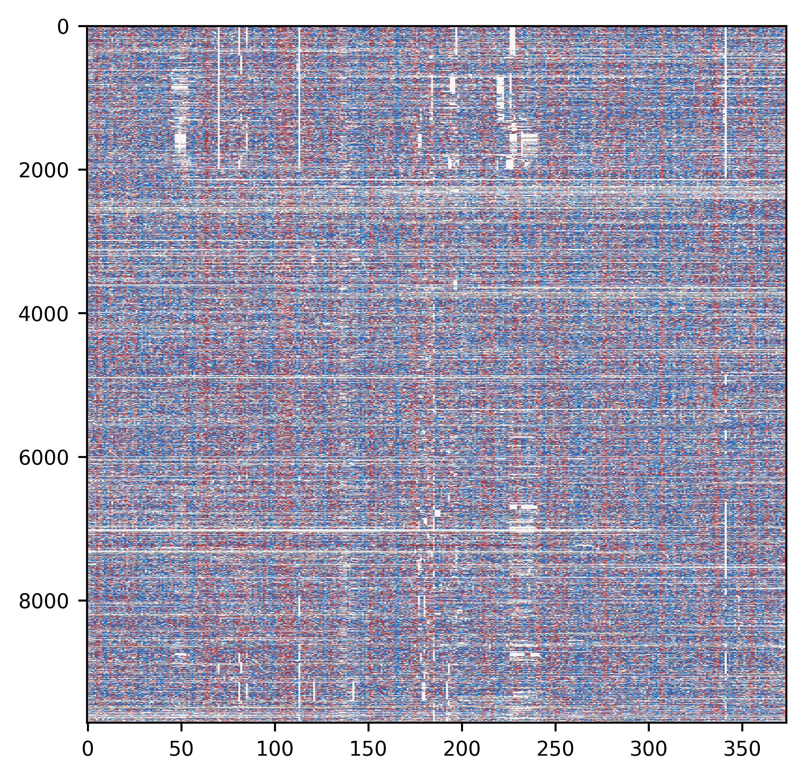
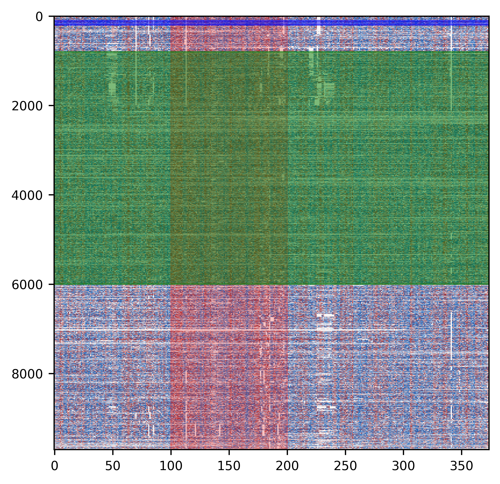

Load libraries


```python
from ma_mapper import mapper
from ma_mapper import plots
from ma_mapper import custom_cmap
```

### Initial Parameters


```python
alignment_filepath = '/rds/project/rds-XrHDlpCeVDg/users/pakkanan/data/output/ma_mapper/hg38_main/alignment/THE1C.fasta.aligned'
AP1_motif_data_filepath = '/rds/project/rds-XrHDlpCeVDg/users/pakkanan/data/resource/annotation/homer_known_motif_hg38/AP-1(bZIP).bed'
NFkB_motif_data_filepath = '/rds/project/rds-XrHDlpCeVDg/users/pakkanan/data/resource/annotation/homer_known_motif_hg38/NFkB-p65(RHD).bed'
phyloP_data_filepath = '/rds/project/rds-XrHDlpCeVDg/users/pakkanan/data/resource/UCSC_phyloP_track/hg38.phyloP447way.bw'
```

Extract genomewide data into data matrix using coordinates and alignment structure from the alignment file 


```python
ap1_matrix=mapper.map_and_overlay(alignment_filepath, AP1_motif_data_filepath,data_format='bed')
nfkb_matrix=mapper.map_and_overlay(alignment_filepath, NFkB_motif_data_filepath,data_format='bed')
phyloP_matrix = mapper.map_and_overlay(alignment_filepath, phyloP_data_filepath, data_format='bigwig')
```

    2025-03-19 07:06:38,324 INFO: parse alignment
    2025-03-19 07:06:45,142 INFO: extract from bed file: /rds/project/rds-XrHDlpCeVDg/users/pakkanan/data/resource/annotation/homer_known_motif_hg38/AP-1(bZIP).bed
    2025-03-19 07:07:15,469 INFO: done, returning bed_out as object
    2025-03-19 07:07:15,720 INFO: {<class 'numpy.float64'>}
    2025-03-19 07:07:15,721 INFO: nested_data:False
    2025-03-19 07:07:16,187 INFO: parse alignment
    2025-03-19 07:07:21,669 INFO: extract from bed file: /rds/project/rds-XrHDlpCeVDg/users/pakkanan/data/resource/annotation/homer_known_motif_hg38/NFkB-p65(RHD).bed
    2025-03-19 07:07:52,513 INFO: done, returning bed_out as object
    2025-03-19 07:07:52,763 INFO: {<class 'numpy.float64'>}
    2025-03-19 07:07:52,764 INFO: nested_data:False
    2025-03-19 07:07:53,243 INFO: parse alignment
    2025-03-19 07:08:01,752 INFO: done, returning bigwig_out as object
    2025-03-19 07:08:02,009 INFO: {<class 'numpy.float32'>}
    2025-03-19 07:08:02,010 INFO: nested_data:False


```python
ap1_matrix
```


    array([[0., 0., 0., ..., 0., 0., 0.],
           [0., 0., 0., ..., 0., 0., 0.],
           [0., 0., 0., ..., 0., 0., 0.],
           ...,
           [0., 0., 0., ..., 0., 0., 0.],
           [0., 0., 0., ..., 0., 0., 0.],
           [0., 0., 0., ..., 0., 0., 0.]])


```python
nfkb_matrix
```


    array([[0., 0., 0., ..., 0., 0., 0.],
           [0., 0., 0., ..., 0., 0., 0.],
           [0., 0., 0., ..., 0., 0., 0.],
           ...,
           [0., 0., 0., ..., 0., 0., 0.],
           [0., 0., 0., ..., 0., 0., 0.],
           [0., 0., 0., ..., 0., 0., 0.]])


```python
phyloP_matrix
```


    array([[-0.41499999,  0.88099998,  0.81400001, ..., -0.954     ,
            -0.33700001,  0.815     ],
           [-0.41499999,  0.88099998,  0.81400001, ..., -0.954     ,
            -0.33700001,  0.815     ],
           [-0.41499999,  0.88099998,  0.81400001, ..., -0.954     ,
            -0.33700001,  0.815     ],
           ...,
           [ 0.003     , -0.34999999,  0.80900002, ...,  0.        ,
             0.        ,  0.        ],
           [ 0.        ,  0.        ,  0.76099998, ...,  0.81699997,
             0.048     ,  0.81699997],
           [ 0.38      ,  0.40799999,  0.40799999, ...,  0.2       ,
             0.        ,  0.        ]])


# PLOT CONFIGURATION
The plots module is a matplotlib wrapper that offer a certain degree of quick configuration for mapped alignment visualization

plot() is the wrapper of functions in this module. At basic level, this function should be enough for data plotting and customization

## heatmap customization
As the output from mapper module is matrix, one of the best way to visualize it is using matplotlib.heatmap, so this module would play around heatmap plot

Here is the most basic form of heatmap:


```python
plots.plot(
    data=[phyloP_matrix], #data matrix
    heatmap_color=[custom_cmap.vlag_r_mpl], #colormap for the heatmap
    vlim =[[-0.5,0.5]]) #data value caps
```


    

    


It is possible to change colormap


```python
plots.plot(
    data=[phyloP_matrix], 
    heatmap_color=["viridis"], 
    vlim =[[-0.5,0.5]],
    )
```


    

    


There might be some data that need to be shown with alignment gap for visual/context clarity, there are specific functions to handle alignment plot


```python
alignment_matrix, coordinate_table=mapper.parse_and_filter(alignment_filepath)
```

    2025-03-19 07:11:01,709 INFO: parse alignment


```python
alignment_matrix
```


    array([[3., 4., 1., ..., 1., 2., 1.],
           [3., 4., 1., ..., 1., 2., 1.],
           [3., 4., 1., ..., 1., 2., 1.],
           ...,
           [3., 4., 1., ..., 0., 0., 0.],
           [0., 0., 1., ..., 1., 2., 1.],
           [3., 4., 2., ..., 1., 0., 0.]])


```python
coordinate_table
```


<div>
<style scoped>
    .dataframe tbody tr th:only-of-type {
        vertical-align: middle;
    }

    .dataframe tbody tr th {
        vertical-align: top;
    }

    .dataframe thead th {
        text-align: right;
    }
</style>
<table border="1" class="dataframe">
  <thead>
    <tr style="text-align: right;">
      <th></th>
      <th>chrom</th>
      <th>start</th>
      <th>end</th>
      <th>name</th>
      <th>score</th>
      <th>strand</th>
      <th>original_order</th>
    </tr>
  </thead>
  <tbody>
    <tr>
      <th>0</th>
      <td>chr1</td>
      <td>119563</td>
      <td>119944</td>
      <td>THE1C_0</td>
      <td>20</td>
      <td>-</td>
      <td>0</td>
    </tr>
    <tr>
      <th>1</th>
      <td>chr1</td>
      <td>296133</td>
      <td>296514</td>
      <td>THE1C_1</td>
      <td>20</td>
      <td>-</td>
      <td>1</td>
    </tr>
    <tr>
      <th>2</th>
      <td>chr1</td>
      <td>710552</td>
      <td>710933</td>
      <td>THE1C_2</td>
      <td>20</td>
      <td>-</td>
      <td>2</td>
    </tr>
    <tr>
      <th>3</th>
      <td>chr19</td>
      <td>181416</td>
      <td>181797</td>
      <td>THE1C_3502</td>
      <td>20</td>
      <td>-</td>
      <td>3</td>
    </tr>
    <tr>
      <th>4</th>
      <td>chr9</td>
      <td>138295330</td>
      <td>138295711</td>
      <td>THE1C_9041</td>
      <td>20</td>
      <td>+</td>
      <td>4</td>
    </tr>
    <tr>
      <th>...</th>
      <td>...</td>
      <td>...</td>
      <td>...</td>
      <td>...</td>
      <td>...</td>
      <td>...</td>
      <td>...</td>
    </tr>
    <tr>
      <th>9775</th>
      <td>chr16</td>
      <td>63291039</td>
      <td>63291257</td>
      <td>THE1C_2951</td>
      <td>20</td>
      <td>+</td>
      <td>9775</td>
    </tr>
    <tr>
      <th>9776</th>
      <td>chrY</td>
      <td>16695786</td>
      <td>16696114</td>
      <td>THE1C_9770</td>
      <td>20</td>
      <td>+</td>
      <td>9776</td>
    </tr>
    <tr>
      <th>9778</th>
      <td>chr2</td>
      <td>190537612</td>
      <td>190537920</td>
      <td>THE1C_4233</td>
      <td>20</td>
      <td>+</td>
      <td>9778</td>
    </tr>
    <tr>
      <th>9782</th>
      <td>chr1</td>
      <td>104208527</td>
      <td>104208749</td>
      <td>THE1C_335</td>
      <td>20</td>
      <td>-</td>
      <td>9782</td>
    </tr>
    <tr>
      <th>9785</th>
      <td>chrX</td>
      <td>139157368</td>
      <td>139157702</td>
      <td>THE1C_9584</td>
      <td>20</td>
      <td>+</td>
      <td>9785</td>
    </tr>
  </tbody>
</table>
<p>9699 rows × 7 columns</p>
</div>


Alignment plot


```python
plots.plot(
    show_alignment=True,
    alignment=alignment_matrix, 
    alignment_col='dna', # color coding for dna
    )
```


    

    


In some context, we only need to see the gaps


```python
plots.plot(
    show_alignment=True,
    alignment=alignment_matrix, 
    alignment_col='nulc_white', 
    )
```


    

    


We can also add colorbars for both heatmap and alignment


```python
plots.plot(
    data=[phyloP_matrix], 
    heatmap_color=["viridis"], 
    vlim =[[-0.5,0.5]],
    colorbar = True, #enable colorbar
    colorbar_steps = [0.1], #control colorbar scale
    )
```

    0


    

    


```python
plots.plot(
    show_alignment=True,
    alignment=alignment_matrix, 
    alignment_col='dna',
    colorbar = True,
    show_alignment_colbar=True 
    )

```


    

    


Similar to data overlay, we can overlay data over alignment


```python
plots.plot(
    data=[ap1_matrix], 
    heatmap_color=["Blues"], 
    vlim =[[0,5]],
    opacity=0.99, #transparency value of heatmap layer
    show_alignment=True,
    alignment=alignment_matrix, 
    alignment_col='nulc_white', 
    )
```


    

    


Title, x-, y- axis label can be added 


```python
plots.plot(
    data=[phyloP_matrix], 
    heatmap_color=[custom_cmap.vlag_r_mpl], 
    vlim =[[-0.5,0.5]],
    heatmap_title=['example plot'],
    heatmap_title_fs=6, #font size
    heatmap_ylabel='seqeunces',
    heatmap_ylabel_fs=14,
    heatmap_xlabel='position (bp)',
    heatmap_xlabel_fs=16,
    ) 
```


    

    


Also, a certain area of the plot an be highlighted


```python
plots.plot(
    data=[phyloP_matrix], 
    heatmap_color=[custom_cmap.vlag_r_mpl], 
    vlim =[[-0.5,0.5]],
    heatmap_yhighlight= [[100,200]],#cooridnates
    heatmap_yhighlight_col= ['red'], #highlight color
    heatmap_yhighlight_alpha = [0.2], #transparent value
    heatmap_xhighlight = [[100,200],[6000,800]],
    heatmap_xhighlight_col = ['blue','green'],
    heatmap_xhighlight_alpha = [0.5,0.5],
    )
```


    

    


## Aggregated plot
this part was intended to show aggregated data from the main plot by normalizing the matrix by column and plot a resulting array as a bar chart

Calculate mean


```python
mean_phyloP=mapper.normalise(alignment_matrix=alignment_matrix, data_matrix=phyloP_matrix, method = 'average')
```


```python
mean_phyloP
```


    array([ 5.16062125e-02, -9.21380350e-02,  9.36411511e-02,  5.68706523e-03,
            2.29936913e-03, -1.03118748e+00, -2.74422022e-01, -2.43238962e-01,
            2.18234695e-01,  2.96313330e-01,  3.11807197e-01,  2.63742259e-03,
           -3.29102902e-01,  2.56523379e-02,  1.96683282e-01, -2.85026334e-01,
            1.28718909e-01,  1.63274243e-03,  2.47981077e-01, -5.51605249e-02,
           -2.09757500e-01, -1.34750974e-01, -1.05029301e-01,  1.84294843e-01,
           -2.18536162e-01, -2.06793814e-01, -2.64010713e-02,  3.28012616e-01,
            1.52361216e-01,  2.89154184e-01,  2.88051049e-01, -8.93759261e-03,
            3.35489083e-01,  8.98356100e-02,  1.40627684e-02,  4.19486224e-02,
            4.98920121e-02,  1.83078115e-01,  1.75031661e-01,  9.46471053e-03,
            3.87713403e-01,  1.48765757e-01, -7.00374549e-02,  2.52841469e-01,
           -3.93063226e-01,  8.61690796e-02,  1.87352775e-01,  1.45686395e-01,
            2.25976432e-01,  3.09407782e-01, -1.62646576e-01, -4.80524246e-02,
           -7.18382474e-02, -2.28231129e-01,  9.99423902e-02,  2.80757512e-01,
            3.34574290e-01,  2.71259908e-01, -4.67353292e-02, -1.82774471e-01,
           -1.09020164e-01, -1.07319223e-01, -1.20824202e-01, -1.05859113e+00,
           -8.93893577e-01, -1.01887240e-02, -1.18383023e-01,  1.60547509e-01,
           -1.98064874e-01, -5.80117148e-01, -1.35359405e-01, -1.78035635e-01,
           -2.39989600e-02, -6.31683057e-03,  2.28880299e-01, -1.16909599e-01,
            2.02527095e-02, -3.24641817e-02,  2.16581303e-01, -2.33143839e-01,
           -2.16265719e-01, -5.24699287e-01, -5.96661080e-01, -2.24555076e-01,
           -2.29274336e-02, -1.88516205e-01, -9.93975476e-03,  1.40394950e-02,
            3.01060245e-01, -8.76358287e-02, -4.09719078e-02,  6.73266066e-02,
            9.48904109e-02,  2.42274157e-01, -7.67112561e-01,  1.17103779e-01,
            7.67543250e-02,  3.12260120e-01,  2.25561490e-01,  3.19584348e-01,
            6.18623733e-03, -2.12286245e-01, -5.53967158e-01, -2.79084384e-01,
           -1.43007183e-01, -4.19329916e-01, -4.19844267e-01, -4.10079434e-01,
           -6.13793501e-01, -8.15164359e-01, -1.68492698e-01,  2.08197752e-01,
            2.66268587e-01,  1.80488370e-01, -1.75867271e-01, -2.52928422e-01,
           -2.69801357e-01, -1.40068287e-01, -2.00830376e-01, -2.57895492e-01,
           -1.45061743e-01, -1.64881043e-02,  2.20087389e-02,  1.77545114e-01,
           -3.71269988e-01,  1.93125607e-01,  4.07004405e-01,  8.99893161e-02,
            2.81473443e-01, -4.04201961e-01, -1.06723787e+00, -2.51977690e-02,
            4.30093478e-02,  1.07400467e-01, -3.88145753e-01,  1.18671734e-01,
           -1.28798246e-01,  3.76218216e-02, -7.94308209e-02,  2.49198972e-01,
           -1.34657579e-01,  1.72900111e-01,  9.17101110e-02,  1.83378294e-01,
           -3.29769779e-02,  2.88128782e-01,  4.05243259e-01,  9.26625434e-02,
            3.44042758e-01,  6.47072827e-02, -9.27823485e-02, -1.16993956e+00,
           -3.91283780e-01,  2.16123271e-01, -7.99737048e-03,  2.29262277e-01,
           -8.92690433e-02,  7.53537035e-04,  6.04878306e-02, -4.09165457e-03,
            8.59546363e-02, -3.00070331e-01, -1.09654721e-01, -7.38176104e-02,
            1.95053314e-01,  4.45241047e-01,  4.06165415e-01,  8.39783795e-02,
           -1.48062857e-01, -4.35458462e-02,  1.01721955e-01,  1.57171443e-01,
           -1.78128307e-01, -2.08194266e-01, -2.08930612e-01, -4.34822154e-01,
           -3.22417116e-01,  1.08741817e-01,  1.48994333e-01,  1.32257877e-01,
           -1.58690647e-01, -2.55528978e-01, -2.62776527e-01, -3.42765895e-01,
           -5.00769913e-01, -8.31146743e-02,  2.39636097e-01,  2.79396906e-01,
           -2.72466930e-01, -4.67803970e-01, -4.58622687e-02,  1.69117276e-01,
           -4.42091062e-01, -4.74465448e-01, -7.64666756e-02, -7.97219595e-02,
            1.18622501e-02, -1.83122099e-01,  1.34930929e-01,  3.03658336e-01,
            2.68908276e-02,  2.65438232e-01, -9.07085153e-02,  1.44645994e-01,
            1.05451909e-01,  2.29612996e-01,  2.66844110e-02,  4.27678440e-02,
            1.72740773e-01,  4.82128697e-02, -3.28552293e-02, -6.12581130e-01,
           -6.91407772e-01,  1.70173958e-02, -1.37523364e-02, -2.33173229e-01,
           -4.04175042e-01, -2.08982216e-01,  1.42966453e-01,  9.39389281e-02,
            3.61070496e-01,  1.86109515e-01,  1.05835675e-01,  2.19652093e-01,
            1.55853386e-01, -1.40340865e-01, -7.36690554e-02,  1.07723433e-01,
           -9.57925281e-01, -9.43840696e-01, -5.37724710e-02, -1.98759440e-01,
            1.29625560e-01,  3.01172599e-01,  3.48642274e-01, -1.77940750e-01,
            3.69852338e-02,  2.44214527e-01,  3.49932039e-01, -4.06802406e-02,
           -1.77123030e-01, -2.10548004e-01, -1.26726372e-01,  2.76951912e-01,
            3.89035056e-01,  1.45222623e-01, -5.96851211e-01, -4.57559796e-01,
            6.86194851e-03, -1.04950923e-01, -5.07175596e-01, -3.52996516e-01,
           -4.19392428e-02,  2.18828311e-01, -4.59774329e-01,  1.15553706e-01,
           -7.79696312e-01,  1.62698530e-01,  2.34800399e-01,  2.07809437e-01,
            3.75568998e-02,  3.11607785e-01,  3.77885882e-01,  4.41969191e-01,
            7.76308289e-02,  1.69274618e-01,  1.64699557e-02,  1.47496274e-01,
            3.51678651e-01,  1.88489049e-01,  1.22145011e-02, -8.33060655e-02,
           -4.10144930e-02,  2.79978594e-01, -7.13877492e-03, -1.80598161e-01,
           -3.10714987e-01, -5.08348055e-01,  1.55593627e-01,  4.40477904e-02,
           -2.57648271e-01,  2.59289022e-02, -1.67037471e-01, -1.69963197e-01,
           -8.04424845e-02, -4.00234500e-01, -2.67858218e-01,  2.00179002e-02,
            4.28915520e-01,  2.24080174e-01,  6.70338442e-03,  9.70844115e-02,
           -1.77242143e-01,  1.11716561e-01, -4.14122610e-02,  3.63406202e-01,
            1.05531665e-02,  2.28716906e-01,  1.73148501e-01,  1.88765266e-01,
           -1.38108963e-01,  2.49023954e-01,  2.04006764e-01,  3.17929241e-01,
            3.73916615e-01,  2.56281921e-01, -4.80708000e-01, -4.90027356e-01,
            1.77394193e-01, -1.12517989e-02,  2.76945723e-01,  3.52140338e-01,
            3.00629065e-01, -5.60426031e-03, -2.81965203e-02,  2.67324130e-01,
            2.81672760e-01,  1.54916945e-01, -8.96053535e-02,  4.49092579e-02,
            2.04636298e-01,  3.06154582e-01,  2.70216286e-01,  2.32191097e-01,
            8.71145984e-02,  1.52334877e-01, -2.20489245e-01, -3.17605410e-01,
           -1.52453534e-01, -3.24675027e-02, -5.91905481e-02,  1.89339522e-01,
            5.53837137e-02,  2.70785786e-01, -5.28948981e-01, -9.37863594e-01,
           -2.05446121e-01, -3.92449389e-01,  6.04244035e-02,  6.33631555e-02,
            7.06272338e-02, -1.17953151e-02,  2.85863788e-01,  9.23099795e-02,
            2.80940752e-01,  3.58366190e-01,  1.30299033e-01,  1.03995343e-01,
           -4.31165355e-01,  2.47687350e-01,  1.37876012e-01, -7.64883124e-02,
            1.42346057e-01, -9.89774222e-02, -4.78303291e-01, -9.23493308e-01,
            2.79594678e-02, -2.27467169e-02,  3.33513722e-01,  5.92911563e-02,
            3.89536797e-01,  2.92123821e-01, -8.11139352e-01, -4.40565583e-01,
            4.89375463e-03,  2.22341596e-01, -1.26035402e-01,  8.58845656e-03,
            1.41458376e-01,  2.68152262e-01, -1.59759144e-01,  1.37133152e-01,
           -5.93189116e-01,  2.21912950e-02])


Here is the most basic aggregated plot


```python
plots.plot(
    heatmap=False,
    aggregated_data=[mean_phyloP], 
    aggregated=True,
    agg_colset=['grey'])
```


    

    


Same as the heatmap, it is possible to change plot color


```python
plots.plot(
    heatmap=False,
    aggregated_data=[mean_phyloP], 
    aggregated=True,
    agg_colset=['red'])
```


    

    


Title, x-, y- axis label can be added 


```python
plots.plot(
    heatmap=False,
    aggregated_data=[mean_phyloP], 
    aggregated=True,
    agg_colset=['grey'],
    agg_plot_title=['example 1d plot'],
    agg_plot_title_fs=12,
    agg_xlabel='position (bp)',
    agg_xlabel_fs=4,
    agg_ylabel=['phyloP'],
    agg_ylabel_fs=8)
```


    

    


Also a certain area of the plot an be highlighted


```python
plots.plot(
    heatmap=False,
    aggregated_data=[mean_phyloP], 
    aggregated=True,
    agg_colset=['grey'],
    agg_xhighlight=[[-0.5,0]],
    agg_xhighlight_col=['red'],
    agg_xhighlight_alpha=[0.5],
    agg_yhighlight=[[50,100],[200,210]],
    agg_yhighlight_col=['blue','green'],
    agg_yhighlight_alpha=[0.1,0.9])
```


    

    


## Annotation configuration
The annotation and annotatin colorbar can be modified to a certain degree.

Genomewide data can be used to sort data matrix.

Calculate AP-1 coverage


```python
ap1_coverage_array=mapper.normalise(alignment_matrix=alignment_matrix, data_matrix=ap1_matrix, method='perc_coverage')
```


```python
ap1_coverage_array
```


    array([1.69006760e-01, 1.38034885e-01, 1.30532811e-01, 1.29214143e-01,
           9.32618326e-02, 6.95652174e-02, 6.94685655e-02, 6.91642651e-02,
           6.91642651e-02, 5.74712644e-02, 6.92281066e-02, 6.91722389e-02,
           6.99219205e-02, 8.54805227e-02, 4.69208211e-02, 4.62000462e-02,
           6.88942473e-02, 5.75638959e-02, 5.76834333e-02, 5.75771534e-02,
           8.01465537e-02, 8.02200321e-02, 4.57823051e-02, 4.58190149e-02,
           3.44946533e-02, 2.29095074e-02, 3.41919307e-02, 6.82128240e-02,
           7.95635372e-02, 6.81740711e-02, 6.82205799e-02, 6.83293475e-02,
           6.82128240e-02, 6.83060109e-02, 6.83526999e-02, 5.70841420e-02,
           2.28545309e-02, 1.15048320e-02, 3.45423143e-02, 3.46540372e-02,
           3.48513011e-02, 2.32612235e-02, 3.47866419e-02, 3.47141865e-02,
           5.86510264e-02, 5.98730691e-02, 6.03864734e-02, 2.56213169e-02,
           3.88450084e-02, 1.32397723e-02, 2.64935753e-02, 1.31061599e-02,
           1.30446126e-02, 1.22354093e-02, 1.19517151e-02, 1.17882824e-02,
           0.00000000e+00, 0.00000000e+00, 0.00000000e+00, 0.00000000e+00,
           0.00000000e+00, 0.00000000e+00, 8.14426992e-02, 1.75131349e-01,
           1.74845553e-01, 1.73671414e-01, 1.73470568e-01, 1.73190163e-01,
           1.74703005e-01, 1.74845553e-01, 1.82592818e-01, 1.04809596e-01,
           0.00000000e+00, 0.00000000e+00, 0.00000000e+00, 1.16346713e-02,
           4.66254808e-02, 3.50590160e-02, 3.50959289e-02, 3.55450237e-02,
           3.52567869e-02, 4.03822856e-02, 3.78119486e-02, 3.50426352e-02,
           2.32964473e-02, 0.00000000e+00, 0.00000000e+00, 0.00000000e+00,
           0.00000000e+00, 0.00000000e+00, 0.00000000e+00, 1.15287065e-02,
           1.15233925e-02, 4.60193281e-02, 5.17818014e+00, 1.00333295e+01,
           1.00692042e+01, 1.00703657e+01, 1.00529710e+01, 1.00599216e+01,
           1.00565755e+01, 1.00578035e+01, 1.00499014e+01, 4.76638814e+00,
           1.73772011e-01, 3.49487418e-02, 2.32612235e-02, 2.33972859e-02,
           2.34659158e-02, 2.34796901e-02, 3.50508237e-02, 3.58251732e-02,
           3.54651850e-02, 3.72093023e-02, 3.53315275e-02, 3.49731872e-02,
           3.50754121e-02, 2.34659158e-02, 2.35100505e-02, 2.36714404e-02,
           1.17827265e-02, 0.00000000e+00, 1.16522955e-02, 1.16130531e-02,
           1.16373793e-02, 0.00000000e+00, 1.16022740e-02, 1.16130531e-02,
           0.00000000e+00, 0.00000000e+00, 1.16945387e-02, 2.32531101e-02,
           2.33699462e-02, 1.17164616e-02, 1.18497452e-02, 0.00000000e+00,
           3.77867746e-01, 8.10773670e-01, 8.36003901e-01, 7.51314801e-01,
           7.75387694e-01, 7.86615058e-01, 7.62865270e-01, 7.72532189e-01,
           7.39125167e-01, 3.72417107e-01, 7.00035002e-02, 4.66744457e-02,
           4.64792006e-02, 4.64630038e-02, 0.00000000e+00, 0.00000000e+00,
           0.00000000e+00, 0.00000000e+00, 0.00000000e+00, 0.00000000e+00,
           0.00000000e+00, 0.00000000e+00, 0.00000000e+00, 0.00000000e+00,
           0.00000000e+00, 0.00000000e+00, 0.00000000e+00, 0.00000000e+00,
           0.00000000e+00, 0.00000000e+00, 0.00000000e+00, 0.00000000e+00,
           0.00000000e+00, 0.00000000e+00, 0.00000000e+00, 0.00000000e+00,
           0.00000000e+00, 2.34055003e-02, 2.33236152e-02, 2.37445091e-02,
           2.45218244e-02, 2.66028199e-02, 2.57466529e-02, 2.49159088e-02,
           2.68420346e-02, 1.25172112e-02, 2.47341083e-02, 2.47862189e-02,
           1.36388434e-02, 3.08261406e-02, 9.66533768e-02, 1.46056475e-01,
           1.47528891e-01, 1.35618296e-01, 1.44473874e-01, 1.32450331e-01,
           1.02459016e-01, 9.48509485e-02, 9.14793518e-02, 3.83680778e-02,
           2.65922085e-02, 2.81333521e-02, 0.00000000e+00, 0.00000000e+00,
           0.00000000e+00, 0.00000000e+00, 0.00000000e+00, 0.00000000e+00,
           0.00000000e+00, 0.00000000e+00, 0.00000000e+00, 0.00000000e+00,
           1.16400885e-02, 1.16577291e-02, 1.16468670e-02, 1.16482236e-02,
           1.16672500e-02, 1.16754232e-02, 1.16822430e-02, 1.18567702e-02,
           1.16849731e-02, 2.34000234e-02, 3.51864884e-02, 3.80904012e-02,
           3.79027164e-02, 3.84270526e-02, 3.79794911e-02, 3.61271676e-02,
           4.93644329e-02, 4.96524330e-02, 1.49276011e-02, 1.44571346e-02,
           0.00000000e+00, 1.35924969e-02, 1.29500130e-02, 1.29752173e-02,
           2.72516692e-02, 2.66773376e-02, 1.33031795e-02, 0.00000000e+00,
           1.31839156e-02, 1.31613583e-02, 1.29937630e-02, 1.24906320e-02,
           0.00000000e+00, 0.00000000e+00, 0.00000000e+00, 0.00000000e+00,
           0.00000000e+00, 0.00000000e+00, 0.00000000e+00, 0.00000000e+00,
           0.00000000e+00, 0.00000000e+00, 4.64846020e-02, 1.16184501e-01,
           1.16171004e-01, 1.15848007e-01, 9.30124404e-02, 3.48756103e-02,
           2.34962406e-02, 7.04638873e-02, 8.27227606e-02, 8.28010409e-02,
           8.22078685e-02, 7.07964602e-02, 0.00000000e+00, 0.00000000e+00,
           0.00000000e+00, 1.17508813e-02, 2.32883093e-02, 2.32828871e-02,
           2.32774674e-02, 1.16495806e-02, 1.16198001e-02, 1.16198001e-02,
           4.63768116e-02, 3.48958939e-02, 1.17605551e-02, 2.32883093e-02,
           4.67235136e-02, 2.33672158e-02, 2.32477043e-02, 2.32558140e-02,
           2.32855979e-02, 2.31964741e-02, 2.33453951e-02, 1.16103564e-02,
           2.32153221e-02, 1.16550117e-02, 4.69869611e-02, 4.64954086e-02,
           3.48594004e-02, 3.48594004e-02, 1.19809236e+00, 7.13351563e-01,
           3.25325684e+01, 6.51271832e+01, 6.53616223e+01, 6.53173122e+01,
           6.51249274e+01, 6.51597908e+01, 6.51405996e+01, 6.48834499e+01,
           6.48059667e+01, 3.25698259e+01, 3.26644890e-01, 5.92540955e-01,
           6.70752862e-01, 4.96020302e-01, 4.64414258e-02, 4.63660600e-02,
           2.31267345e-02, 1.16036203e-02, 3.49406010e-02, 1.15888284e-02,
           0.00000000e+00, 0.00000000e+00, 0.00000000e+00, 1.15968920e-02,
           1.15754138e-02, 0.00000000e+00, 4.65386853e-02, 8.12253423e-02,
           6.98080279e-02, 6.94766095e-02, 2.31696015e-01, 4.28786650e-01,
           4.28736964e-01, 4.29184549e-01, 4.30182537e-01, 3.94706292e-01,
           3.59212051e-01, 3.70756575e-01, 3.59962843e-01, 1.97330238e-01,
           0.00000000e+00, 0.00000000e+00, 0.00000000e+00, 0.00000000e+00,
           0.00000000e+00, 0.00000000e+00, 1.16658889e-02, 0.00000000e+00,
           0.00000000e+00, 0.00000000e+00, 0.00000000e+00, 0.00000000e+00,
           0.00000000e+00, 0.00000000e+00, 0.00000000e+00, 0.00000000e+00,
           0.00000000e+00, 0.00000000e+00, 0.00000000e+00, 0.00000000e+00,
           0.00000000e+00, 0.00000000e+00, 0.00000000e+00, 0.00000000e+00,
           2.34274335e-02, 0.00000000e+00, 0.00000000e+00, 0.00000000e+00,
           0.00000000e+00, 2.35183443e-02, 5.30973451e-01, 9.69840331e-01,
           1.02703341e+00, 1.03908372e+00, 1.04191333e+00, 1.04488245e+00,
           1.04799333e+00, 1.05175093e+00, 1.06563333e+00, 5.76262874e-01,
           1.30514226e-02, 2.73672687e-02])


Since the coordinate table was filtered in parse and filter function, reset index to match positions in output matrices


```python
coordinate_table = coordinate_table.reset_index()
```


```python
coordinate_table
```


<div>
<style scoped>
    .dataframe tbody tr th:only-of-type {
        vertical-align: middle;
    }

    .dataframe tbody tr th {
        vertical-align: top;
    }

    .dataframe thead th {
        text-align: right;
    }
</style>
<table border="1" class="dataframe">
  <thead>
    <tr style="text-align: right;">
      <th></th>
      <th>index</th>
      <th>chrom</th>
      <th>start</th>
      <th>end</th>
      <th>name</th>
      <th>score</th>
      <th>strand</th>
      <th>original_order</th>
    </tr>
  </thead>
  <tbody>
    <tr>
      <th>0</th>
      <td>0</td>
      <td>chr1</td>
      <td>119563</td>
      <td>119944</td>
      <td>THE1C_0</td>
      <td>20</td>
      <td>-</td>
      <td>0</td>
    </tr>
    <tr>
      <th>1</th>
      <td>1</td>
      <td>chr1</td>
      <td>296133</td>
      <td>296514</td>
      <td>THE1C_1</td>
      <td>20</td>
      <td>-</td>
      <td>1</td>
    </tr>
    <tr>
      <th>2</th>
      <td>2</td>
      <td>chr1</td>
      <td>710552</td>
      <td>710933</td>
      <td>THE1C_2</td>
      <td>20</td>
      <td>-</td>
      <td>2</td>
    </tr>
    <tr>
      <th>3</th>
      <td>3</td>
      <td>chr19</td>
      <td>181416</td>
      <td>181797</td>
      <td>THE1C_3502</td>
      <td>20</td>
      <td>-</td>
      <td>3</td>
    </tr>
    <tr>
      <th>4</th>
      <td>4</td>
      <td>chr9</td>
      <td>138295330</td>
      <td>138295711</td>
      <td>THE1C_9041</td>
      <td>20</td>
      <td>+</td>
      <td>4</td>
    </tr>
    <tr>
      <th>...</th>
      <td>...</td>
      <td>...</td>
      <td>...</td>
      <td>...</td>
      <td>...</td>
      <td>...</td>
      <td>...</td>
      <td>...</td>
    </tr>
    <tr>
      <th>9694</th>
      <td>9775</td>
      <td>chr16</td>
      <td>63291039</td>
      <td>63291257</td>
      <td>THE1C_2951</td>
      <td>20</td>
      <td>+</td>
      <td>9775</td>
    </tr>
    <tr>
      <th>9695</th>
      <td>9776</td>
      <td>chrY</td>
      <td>16695786</td>
      <td>16696114</td>
      <td>THE1C_9770</td>
      <td>20</td>
      <td>+</td>
      <td>9776</td>
    </tr>
    <tr>
      <th>9696</th>
      <td>9778</td>
      <td>chr2</td>
      <td>190537612</td>
      <td>190537920</td>
      <td>THE1C_4233</td>
      <td>20</td>
      <td>+</td>
      <td>9778</td>
    </tr>
    <tr>
      <th>9697</th>
      <td>9782</td>
      <td>chr1</td>
      <td>104208527</td>
      <td>104208749</td>
      <td>THE1C_335</td>
      <td>20</td>
      <td>-</td>
      <td>9782</td>
    </tr>
    <tr>
      <th>9698</th>
      <td>9785</td>
      <td>chrX</td>
      <td>139157368</td>
      <td>139157702</td>
      <td>THE1C_9584</td>
      <td>20</td>
      <td>+</td>
      <td>9785</td>
    </tr>
  </tbody>
</table>
<p>9699 rows × 8 columns</p>
</div>


Find peaks of coverage


```python
import scipy
peaks, _ = scipy.signal.find_peaks(ap1_coverage_array, width = 6)
```


```python
peaks
```


    array([ 28,  70,  76,  97, 113, 138, 180, 188, 225, 294, 326, 370])


Find row indices


```python
import numpy as np
index_of_rows_with_ap1 = np.unique(np.where(ap1_matrix[:, peaks] != 0)[0])
index_of_rows_without_ap1=list(set(np.arange(ap1_matrix.shape[0])) - set(index_of_rows_with_ap1))
```

Annotate the coordinate table with peaks


```python
coordinate_table['AP1_motif'] = 1
coordinate_table.loc[coordinate_table.index.isin(index_of_rows_with_ap1), 'AP1_motif'] = 0
```

Extract annotation from metadata


```python
ap1_motif_annotation=coordinate_table['AP1_motif']
```


```python
ap1_motif_annotation
```


    0       1
    1       1
    2       1
    3       1
    4       1
           ..
    9694    1
    9695    1
    9696    1
    9697    1
    9698    1
    Name: AP1_motif, Length: 9699, dtype: int64


Basic annotation configuration


```python
plots.plot(
    data=[phyloP_matrix], 
    heatmap_color=[custom_cmap.vlag_r_mpl], 
    vlim =[[-0.5,0.5]], 
    opacity=0.99, 
    annotation = True,  #enable annotation
    anno_col=[['blue','white']], #annotation colorset
    annotation_data= [ap1_motif_annotation], #annotation array
    anno_cbar_label=[['TE with AP1 motif', 'TE without AP1 motif']]) #annotation label
```


    

    


We can adjust label and title


```python
plots.plot(
    data=[phyloP_matrix], 
    heatmap_color=[custom_cmap.vlag_r_mpl], 
    vlim =[[-0.5,0.5]], 
    opacity=0.99, 
    annotation = True,  #enable annotation
    anno_col=[['blue','white']], #annotation colorset
    annotation_data= [ap1_motif_annotation], #annotation array
    anno_cbar_label=[['TE with AP1 motif', 'TE without AP1 motif']], #annotation label
    anno_ylabel='example',
    anno_ylabel_fs=12,
    anno_cbar = True,
    anno_cbar_title=['example cbar'],
)
```


    

    

